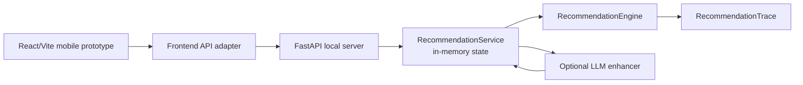

# MediDiet

LLM-friendly project map for the MediDiet hospital meal recommendation MVP.

Last reviewed: 2026-05-19
Python package version: `0.1.1`
Rule pack version: `baseline-2026-05-15`

## 1. What This Is

MediDiet is a hospital diet recommendation assistant prototype. It combines:

- A deterministic Python recommendation engine for chronic-disease meal matching.
- A local FastAPI HTTP server for frontend integration and demo flows.
- An optional OpenAI-compatible LLM explanation layer with strict fallback behavior.
- A React/Vite mobile web prototype that demonstrates patient, dietitian, and catering workflows.

The core product idea is:

> Given a patient profile, recent intake records, and today's hospital menu, recommend the next meal only when the rule engine can do so safely. Otherwise, refuse automatic recommendation or require human review, while preserving an auditable trace.

## 2. What This Is Not

Current MVP boundaries:

- Not a production clinical decision system.
- Not a native WeChat Mini Program yet; the frontend is a browser prototype.
- No production authentication, authorization, audit store, rate limiting, or database.
- No real HIS/EMR connector.
- No real image recognition service.
- No real canteen, delivery, payment, or fulfillment integration.
- Baseline nutrition thresholds are demo rules and require clinical review before production use.

## 3. LLM Reading Guide

If you are an LLM agent, read in this order:

1. `README.md` for project orientation and boundaries.
2. `docs/usage.md` for backend run commands and operational notes.
3. `docs/api.md` for domain models, public API, trace, HTTP boundary, and LLM exports.
4. `docs/demo-usage.md` for copy-paste HTTP demo commands.
5. `apps/mini-program-prototype/README.zh.md` for frontend behavior and backend adapter notes.
6. `docs/testing.md` for test intent, coverage, and known gaps.

When editing:

- Prefer preserving structured enums and integer codes over adding string matching.
- Do not move clinical logic into the frontend.
- Do not treat LLM output as source of truth; deterministic rules and trace remain authoritative.
- Do not add production claims unless authentication, persistence, audit, and clinical review are actually implemented.

## 4. Repository Map

```text
MediDiet/
  src/medidiet/
    domain.py      # Core dataclasses, enums, ConceptCode, Nutrients, PatientProfile, MenuItem.
    rules.py       # Baseline rule pack and nutrient limits.
    safety.py      # Safety gate, SafetyCode, human-review triggers, warning logs.
    nutrition.py   # Daily and rolling-window nutrient calculations.
    planner.py     # Next-meal plan generation and patient instructions.
    matcher.py     # Menu filtering and scoring.
    explainer.py   # Deterministic patient and clinician explanations.
    trace.py       # RecommendationTrace JSON/camelCase serialization.
    engine.py      # RecommendationEngine orchestration.
    service.py     # In-memory application service and HTTP DTO conversion.
    server.py      # FastAPI app and endpoints.
    llm.py         # Optional LLM enhancement, QA, sanitization, and fallback.
    ports.py       # Future external-system Protocols and domain events.
    fixtures.py    # Local demo data.
    cli.py         # Minimal CLI trace demo.

  apps/mini-program-prototype/
    src/App.tsx
    src/contracts.ts
    src/state.ts
    src/fixtures.ts
    src/api/          # Frontend/backend DTO adapters and HTTP client.
    src/features/     # Patient, dietitian, catering workspaces.

  tests/              # Python unittest suite.
  docs/               # Usage, API, testing, demo, and frontend E2E docs.
```

## 5. Architecture Snapshot



Important split:

- The Python engine owns recommendation logic, safety checks, scoring, and trace.
- The FastAPI service owns demo HTTP endpoints and in-memory state.
- The frontend owns presentation, role switching, local review simulation, and HTTP adapter calls.
- The LLM layer can rewrite explanations only after sanitization and validation; fallback keeps deterministic explanations.

## 6. Quick Start

### 6.1 Backend Setup

```bash
python -m pip install -e .
```

Run the deterministic CLI demo:

```bash
PYTHONPATH=src python -m medidiet.cli
```

Run the local HTTP server:

```bash
uvicorn medidiet.server:app --app-dir src --reload
```

Health check:

```bash
curl -s http://127.0.0.1:8000/health
```

Expected shape:

```json
{"status":"ok","version":"0.1.1","ruleVersion":"baseline-2026-05-15"}
```

OpenAPI docs:

```text
http://127.0.0.1:8000/docs
```

### 6.2 Frontend Setup

In a second terminal:

```bash
cd apps/mini-program-prototype
npm install
npm run dev -- --host 127.0.0.1
```

Open:

```text
http://127.0.0.1:5173/
```

The Vite dev server proxies `/api/*` to `http://127.0.0.1:8000/*`.

To override the backend URL:

```bash
VITE_MEDIDIET_API_BASE_URL=http://127.0.0.1:8000 npm run dev -- --host 127.0.0.1
```

## 7. HTTP Demo Flow

The local server uses in-memory state. Restarting the server clears patients, intake records, menus, and nutritionist reviews.

Typical flow:

1. `PUT /patients/{patient_id}` creates or replaces a patient profile.
2. `POST /patients/{patient_id}/intake-records` appends intake records.
3. `PUT /menus/today` replaces today's menu.
4. `POST /reviews/nutritionist` records optional dietitian notes.
5. `POST /recommendations` returns outcome, recommended items, explanation, LLM fallback metadata, trace id, and optional debug trace.
6. `GET /debug/state` exposes in-memory demo counts.

Use `docs/demo-usage.md` for complete curl commands.

## 8. Core Recommendation Outcomes

| Outcome | Meaning | Current behavior |
| --- | --- | --- |
| `recommended` | The engine found a safe ranked item. | Returns the highest-scoring menu item. |
| `refused` | All candidates were excluded after safety passed. | Returns no menu item and a refusal explanation. |
| `human_review_required` | Safety hard block or uncertainty was detected. | Returns no menu item and routes to review semantics. |
| `downgraded` | Reserved enum. | Not actively emitted by the engine today. |

Safety and rejection reasons use integer enums:

- `SafetyCode`: `1001-2003`
- `NutritionReason`: `3001-3003`
- `MealInstruction`: `4001-4004`
- `MatchRejectionCode`: `5001-5003`
- `LLMFallbackReason`: `6001-6007`

## 9. LLM Layer

The LLM layer is optional.

Default behavior:

- Without LLM env vars, service recommendations still work.
- Explanation enhancement falls back to deterministic engine text.
- Fallback metadata is returned in `explanation.llm`.

OpenAI-compatible configuration:

```bash
export MEDIDIET_LLM_PROVIDER=openai_compatible
export MEDIDIET_LLM_BASE_URL=https://api.deepseek.com
export MEDIDIET_LLM_API_KEY=replace_with_your_api_key
export MEDIDIET_LLM_MODEL=deepseek-v4
export MEDIDIET_LLM_TIMEOUT_SECONDS=30
```

Live LLM smoke tests are opt-in:

```bash
export MEDIDIET_LLM_SMOKE_TEST=1
PYTHONPATH=src python -m unittest tests.test_llm_deepseek_smoke tests.test_http_llm_smoke -v
```

LLM safety rules:

- Patient id is stripped from LLM context by `LLMContextSanitizer`.
- Provider errors, invalid JSON, empty fields, unsafe text, and out-of-scope questions trigger fallback.
- LLM explanations must not convert refused or review-required outcomes into positive recommendations.

## 10. Test Commands

Backend:

```bash
PYTHONPATH=src python -m unittest discover -s tests -v
```

Frontend:

```bash
cd apps/mini-program-prototype
npm run test
npm run build
```

Recommended pre-commit check:

```bash
PYTHONPATH=src python -m unittest discover -s tests -v
cd apps/mini-program-prototype && npm run test && npm run build
```

## 11. Frontend Behavior Summary

The frontend has three role workspaces:

- Patient: profile summary, intake list, backend recommendation request, refusal state, waiting-review state.
- Dietitian: local pending-review queue, trace evidence display, approve/modify/reject simulation.
- Catering: menu quality display, availability toggle, lightweight fulfillment status.

Current frontend/backend split:

- Patient "get recommendation" calls the real local HTTP backend.
- Frontend seeds demo patient, intake records, and safe menu candidates before requesting recommendations.
- Dietitian review actions and catering fulfillment remain local prototype state.
- The frontend filters out unavailable or low-confidence menu items before sending recommendation candidates to the backend.

## 12. Important Domain Conventions

Use these conventions consistently:

- `MealLabel` is an integer enum: `1` breakfast, `2` lunch, `3` dinner, `4` snack.
- Python internal fields use `snake_case`.
- HTTP and frontend DTO fields use `camelCase`.
- Medical concepts use `ConceptCode(kind, value)` rather than raw strings.
- Trace output is camelCase and must remain audit-friendly.
- Patient-facing explanations must avoid diagnosis, medication changes, or unsupported medical promises.
- The frontend should display recommendation state and explanations, not recompute clinical rules.

## 13. Production Gaps

Before production use, add:

- Persistent storage for patients, intake records, menu data, trace, reviews, and audit logs.
- Authentication, authorization, patient binding, institution scoping, and role permissions.
- HIS/EMR, image recognition, canteen/menu, and event-system adapters.
- Clinical review of rule pack thresholds, source citations, versioning, rollout, and rollback.
- Privacy controls for patient identifiers, logs, trace retention, and LLM provider boundaries.
- Observability, rate limiting, error budgets, backup, disaster recovery, and operational runbooks.

## 14. Source Documents

| Document | Purpose |
| --- | --- |
| `docs/usage.md` | Backend usage and local HTTP server notes. |
| `docs/api.md` | Python public API, data models, trace, ports, LLM exports. |
| `docs/testing.md` | Test coverage, boundaries, and regression advice. |
| `docs/demo-usage.md` | End-to-end HTTP demo script. |
| `docs/frontend-backend-usage-boundary.zh.md` | Frontend/backend capability and boundary overview. |
| `apps/mini-program-prototype/README.zh.md` | Frontend prototype usage and role flows. |
| `docs/frontend-e2e-llm-verification.zh.md` | Frontend E2E verification method with LLM-assisted checks. |
| `docs/frontend-e2e-test-results-2026-05-19.zh.md` | Latest recorded frontend E2E result evidence. |
