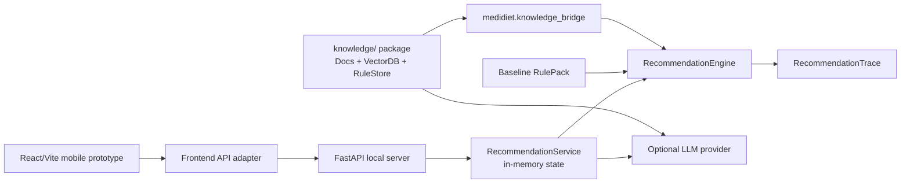

# MediDiet

LLM-friendly project map for the MediDiet hospital meal recommendation MVP.

Last reviewed: 2026-05-21
Core package metadata version: `0.1.1`
Current documentation/test milestone: `0.1.4`
Baseline rule pack version: `baseline-2026-05-15`

## 1. What This Is

MediDiet is a hospital diet recommendation assistant prototype. It combines:

- A deterministic Python recommendation engine for chronic-disease meal matching.
- A local FastAPI HTTP server for frontend integration and demo flows.
- An optional OpenAI-compatible LLM explanation and question-answering layer with strict fallback behavior.
- A nutrition knowledge base package for document ingestion, vector search, LLM rule extraction, human curation, and versioned rule publishing.
- A bridge from the knowledge base into the recommendation engine for online knowledge snippets, knowledge-backed rule packs, nutrient gap compensation, and ingredient diversity scoring.
- A React/Vite mobile web prototype that demonstrates patient, dietitian, and catering workflows.

The core product idea is:

> Given a patient profile, recent intake records, and today's hospital menu, recommend the next meal only when deterministic rules can do so safely. Otherwise, refuse automatic recommendation or require human review, while preserving an auditable trace and optional source-backed knowledge context.

## 2. What This Is Not

Current MVP boundaries:

- Not a production clinical decision system.
- Not a native WeChat Mini Program yet; the frontend is a browser prototype.
- No production authentication, authorization, audit store, rate limiting, or database.
- No real HIS/EMR connector.
- No real image recognition service.
- No real canteen, delivery, payment, or fulfillment integration.
- Baseline and knowledge-extracted nutrition thresholds are demo or pilot rules and require clinical review before production use.
- LLM output is never authoritative. It can enrich explanations or propose candidate rules, but deterministic rules, human review, and trace remain the source of truth.

## 3. LLM Reading Guide

If you are an LLM agent, read in this order:

1. `README.md` for project orientation, boundaries, and run commands.
2. `docs/api.md` for the current public API, Phase 3 engine parameters, ports, trace, and knowledge bridge notes.
3. `docs/testing.md` for the current test command, coverage map, skipped real-LLM tests, and known gaps.
4. `docs/nutrition-knowledge-base-test-cases.md` for knowledge-base behavior, QA matrix, and Phase 1/2/3 coverage.
5. `docs/phase-3-knowledge-engine-e2e-testing.md` for online knowledge enhancement, nutrient gap compensation, and ingredient diversity E2E scenarios.
6. `docs/demo-usage.md` for copy-paste HTTP demo commands.
7. `apps/mini-program-prototype/README.zh.md` for frontend behavior and backend adapter notes.
8. `reports/knowledge-extraction-real-llm-smoke-report.md` for the latest recorded real LLM smoke report.

When editing:

- Preserve structured enums and integer codes. Do not replace them with free-text matching.
- Keep clinical recommendation logic in the Python engine, not in the frontend.
- Keep heavy knowledge dependencies out of top-level `medidiet` imports. Import bridge adapters from `medidiet.knowledge_bridge`.
- Treat LLM rule extraction as a candidate-generation workflow. Published rules must pass validation and human curation.
- Do not make production claims unless auth, persistence, audit, privacy, operations, and clinical review are actually implemented.

## 4. Repository Map

```text
MediDiet/
  src/medidiet/
    domain.py           # Core dataclasses, enums, ConceptCode, Nutrients, PatientProfile, MenuItem.
    rules.py            # Baseline rule pack, ConditionRule, NutrientLimit.
    safety.py           # Safety gate, SafetyCode, human-review triggers, warning logs.
    nutrition.py        # Daily/rolling calculations plus previous-meal nutrient gap compensation.
    planner.py          # Next-meal plan generation and patient instructions.
    matcher.py          # Menu filtering/scoring plus recent-ingredient diversity penalty.
    explainer.py        # Deterministic patient and clinician explanations.
    trace.py            # RecommendationTrace JSON/camelCase serialization.
    engine.py           # RecommendationEngine orchestration and optional KnowledgePort enrichment.
    ports.py            # External-system, rule-provider, and knowledge-provider Protocols.
    knowledge_bridge.py # Adapters from knowledge/ RuleStore/VectorDB to medidiet ports.
    llm.py              # Optional LLM explanation, QA, rule-extraction tasks, fallback safety.
    service.py          # In-memory application service and HTTP DTO conversion.
    server.py           # FastAPI app and endpoints.
    fixtures.py         # Local demo data.
    cli.py              # Minimal CLI trace demo.

  knowledge/
    src/knowledge/
      schema.py         # KnowledgeDocument, ExtractedConditionRule, VerificationResult.
      documents.py      # Text/file import and chunking.
      loader.py         # Directory loading and optional vector indexing.
      vectordb.py       # ChromaDB-backed semantic search.
      store.py          # Candidate rule CRUD, JSON persistence, version publishing.
      extractor.py      # Two-stage LLM rule extraction and cross-validation.
      curator.py        # Human-in-the-loop review, rejection, publish API.
    source_documents/   # Pilot guideline markdown inputs.
    tests/              # Knowledge package pytest suite.

  apps/mini-program-prototype/
    src/App.tsx
    src/contracts.ts
    src/state.ts
    src/fixtures.ts
    src/api/            # Frontend/backend DTO adapters and HTTP client.
    src/features/       # Patient, dietitian, catering workspaces.

  tests/                # Core medidiet pytest suite.
  docs/                 # Usage, API, testing, demo, frontend E2E, knowledge E2E docs.
  reports/              # Real LLM smoke test reports.
  scripts/              # Utility scripts, including real LLM smoke report runner.
```

## 5. Architecture Snapshot



Important split:

- The Python engine owns recommendation logic, safety checks, scoring, trace, gap compensation, diversity scoring, and optional knowledge enrichment.
- The `knowledge/` package owns document ingestion, ChromaDB indexing, candidate rule extraction, validation, human curation, and versioned rule storage.
- `medidiet.knowledge_bridge` adapts knowledge package objects to lightweight `medidiet.ports` interfaces.
- The FastAPI service owns demo HTTP endpoints and in-memory state.
- The frontend owns presentation, role switching, local review simulation, and HTTP adapter calls.
- The LLM layer can enrich explanations or propose candidate rules only after sanitization, schema validation, and fallback checks.

## 6. Quick Start

### 6.1 Backend Core Setup

```bash
python -m pip install -e .
```

Run the deterministic CLI demo:

```bash
PYTHONPATH=src python -m medidiet.cli
```

Run the local HTTP server:

```bash
uvicorn medidiet.server:app --app-dir src --reload
```

Health check:

```bash
curl -s http://127.0.0.1:8000/health
```

Expected shape:

```json
{"status":"ok","version":"0.1.1","ruleVersion":"baseline-2026-05-15"}
```

OpenAPI docs:

```text
http://127.0.0.1:8000/docs
```

### 6.2 Knowledge Package Setup

Install the knowledge package when you need document ingestion, ChromaDB vector search, rule extraction, or knowledge-backed RulePack loading:

```bash
python -m pip install -e .
python -m pip install -e ./knowledge
```

For local test/dev commands without installing both packages, use:

```bash
PYTHONPATH=src:knowledge/src
```

### 6.3 Frontend Setup

In a second terminal:

```bash
cd apps/mini-program-prototype
npm install
npm run dev -- --host 127.0.0.1
```

Open:

```text
http://127.0.0.1:5173/
```

The Vite dev server proxies `/api/*` to `http://127.0.0.1:8000/*`.

To override the backend URL:

```bash
VITE_MEDIDIET_API_BASE_URL=http://127.0.0.1:8000 npm run dev -- --host 127.0.0.1
```

## 7. HTTP Demo Flow

The local server uses in-memory state. Restarting the server clears patients, intake records, menus, and nutritionist reviews.

Typical flow:

1. `PUT /patients/{patient_id}` creates or replaces a patient profile.
2. `POST /patients/{patient_id}/intake-records` appends intake records.
3. `PUT /menus/today` replaces today's menu.
4. `POST /reviews/nutritionist` records optional dietitian notes.
5. `POST /recommendations` returns outcome, recommended items, explanation, LLM fallback metadata, trace id, and optional debug trace.
6. `GET /debug/state` exposes in-memory demo counts.

Use `docs/demo-usage.md` for complete curl commands.

## 8. Core Recommendation Outcomes

| Outcome | Meaning | Current behavior |
| --- | --- | --- |
| `recommended` | The engine found a safe ranked item. | Returns the highest-scoring menu item. |
| `refused` | All candidates were excluded after safety passed. | Returns no menu item and a refusal explanation. |
| `human_review_required` | Safety hard block or uncertainty was detected. | Returns no menu item and routes to review semantics. |
| `downgraded` | Reserved enum. | Not actively emitted by the engine today. |

Safety, planning, matching, and LLM fallback reasons use integer enums:

- `SafetyCode`: `1001-2003`
- `NutritionReason`: `3001-3003`
- `MealInstruction`: `4001-4004`
- `MatchRejectionCode`: `5001-5003`
- `LLMFallbackReason`: `6001-6007`

## 9. Phase 3 Engine Features

The current engine has three important extensions beyond the original baseline flow:

1. Online knowledge enrichment
   - Pass a `KnowledgePort` implementation into `RecommendationEngine`.
   - The engine calls `knowledge.retrieve_context(patient, meal_label)` after the recommendation result is known.
   - Returned snippets are added to `clinician_explanation["knowledgeSnippets"]`.
   - Retrieval failures silently degrade and must not change the safety outcome.

2. Previous-meal nutrient gap compensation
   - Lunch can compensate for breakfast; dinner can compensate for lunch.
   - Low protein in the previous meal adds `lean_protein`.
   - Low fiber in the previous meal adds `high_fiber`.
   - Only same-day previous-meal records are considered.

3. Ingredient diversity scoring
   - Pass `recent_ingredients=frozenset({...})` into `RecommendationEngine`.
   - Each repeated candidate ingredient loses 1 score point.
   - This is a ranking adjustment, not a safety override.

Knowledge-backed engine example:

```python
from medidiet import RecommendationEngine
from medidiet.domain import CodeKind, ConceptCode
from medidiet.knowledge_bridge import KnowledgeRetriever, KnowledgeRuleProvider
from knowledge.store import RuleStore
from knowledge.vectordb import KnowledgeVectorDB

store = RuleStore(data_dir="data")
rule_pack = KnowledgeRuleProvider(store=store, version="v1.0").load_rule_pack()
retriever = KnowledgeRetriever(KnowledgeVectorDB(persist_dir="data/chroma"))

engine = RecommendationEngine(
    rule_pack=rule_pack,
    knowledge=retriever,
    recent_ingredients=frozenset({ConceptCode(CodeKind.INGREDIENT, "fish")}),
)
```

## 10. Knowledge Base Workflow

The `knowledge/` package supports this pilot workflow:

1. Import documents with `DocumentImporter` or `KnowledgeLoader`.
2. Chunk guideline/manual text into `DocumentChunk` objects.
3. Index chunks in `KnowledgeVectorDB` for semantic search.
4. Extract candidate rules with `RuleExtractor` using `LLMTask.RULE_EXTRACTION`.
5. Cross-validate extracted rules with `LLMTask.RULE_VALIDATION`.
6. Store candidates in `RuleStore`.
7. Review, approve, or reject candidates with `KnowledgeCurator`.
8. Publish approved rules as a versioned rule set.
9. Load the published version through `KnowledgeRuleProvider`.
10. Inject `KnowledgeRetriever` into the engine for source snippets.

Current pilot source documents:

- `knowledge/source_documents/guidelines/ckd.md`
- `knowledge/source_documents/guidelines/gout.md`

Current knowledge package boundaries:

- JSON file storage and local ChromaDB are for local MVP use.
- Rule extraction uses LLM output as draft candidate data, not approved clinical truth.
- Human review is required before publishing extracted rules.
- Production storage, migrations, reviewer identity, and audit controls are not implemented.

## 11. LLM Layer

The LLM layer is optional.

Default behavior:

- Without LLM env vars, service recommendations still work.
- Explanation enhancement falls back to deterministic engine text.
- Fallback metadata is returned in `explanation.llm`.

OpenAI-compatible configuration:

```bash
export MEDIDIET_LLM_PROVIDER=openai_compatible
export MEDIDIET_LLM_BASE_URL=https://api.deepseek.com
export MEDIDIET_LLM_API_KEY=replace_with_your_api_key
export MEDIDIET_LLM_MODEL=deepseek-v4
export MEDIDIET_LLM_TIMEOUT_SECONDS=30
```

Real LLM smoke tests are opt-in. For the full report-producing smoke flow:

```bash
export MEDIDIET_LLM_SMOKE_TEST=1
export MEDIDIET_LLM_RULE_SMOKE_TEST=1
export MEDIDIET_LLM_CONFLICT_SMOKE_TEST=1
export MEDIDIET_LLM_NOISY_SMOKE_TEST=1
PYTHONPATH=src:knowledge/src python scripts/run_real_llm_smoke_tests.py --report reports/knowledge-extraction-real-llm-smoke-report.md
```

LLM safety rules:

- Patient id is stripped from LLM context by `LLMContextSanitizer`.
- Provider errors, invalid JSON, empty fields, unsafe text, and out-of-scope questions trigger fallback.
- LLM explanations must not convert refused or review-required outcomes into positive recommendations.
- LLM rule extraction must emit schema-valid draft rules and evidence quotes.
- Conflicting, prompt-injected, or noise-only source material must not auto-approve or publish unsafe rules.

## 12. Test Commands

Backend + knowledge full offline suite:

```bash
PYTHONPATH=src:knowledge/src pytest tests/ knowledge/tests/ --rootdir=. -q
```

Focused Phase 3 suite:

```bash
PYTHONPATH=src:knowledge/src pytest \
  tests/test_knowledge_integration.py \
  tests/test_knowledge_bridge.py \
  tests/test_engine.py \
  tests/test_nutrition.py \
  tests/test_matcher.py \
  tests/test_llm.py \
  knowledge/tests/ \
  --rootdir=. -q
```

Frontend:

```bash
cd apps/mini-program-prototype
npm run test
npm run build
```

Recommended pre-PR check:

```bash
PYTHONPATH=src:knowledge/src pytest tests/ knowledge/tests/ --rootdir=. -q
cd apps/mini-program-prototype && npm run test && npm run build
```

Expected current offline baseline:

```text
254 passed, 12 skipped
```

The skipped tests are real LLM smoke tests unless the relevant env vars are explicitly enabled.

## 13. Frontend Behavior Summary

The frontend has three role workspaces:

- Patient: profile summary, intake list, backend recommendation request, refusal state, waiting-review state.
- Dietitian: local pending-review queue, trace evidence display, approve/modify/reject simulation.
- Catering: menu quality display, availability toggle, lightweight fulfillment status.

Current frontend/backend split:

- Patient "get recommendation" calls the real local HTTP backend.
- Frontend seeds demo patient, intake records, and safe menu candidates before requesting recommendations.
- Dietitian review actions and catering fulfillment remain local prototype state.
- The frontend filters out unavailable or low-confidence menu items before sending recommendation candidates to the backend.

## 14. Important Domain Conventions

Use these conventions consistently:

- `MealLabel` is an integer enum: `1` breakfast, `2` lunch, `3` dinner, `4` snack.
- Python internal fields use `snake_case`.
- HTTP and frontend DTO fields use `camelCase`.
- Medical concepts use `ConceptCode(kind, value)` rather than raw strings.
- `KnowledgeRuleProvider` and `KnowledgeRetriever` live in `medidiet.knowledge_bridge`, not top-level `medidiet`.
- Trace output is camelCase and must remain audit-friendly.
- Patient-facing explanations must avoid diagnosis, medication changes, or unsupported medical promises.
- Knowledge snippets are source context for clinicians; they do not override safety checks.
- The frontend should display recommendation state and explanations, not recompute clinical rules.

## 15. Production Gaps

Before production use, add:

- Persistent storage for patients, intake records, menu data, trace, reviews, rule candidates, published rule versions, and audit logs.
- Authentication, authorization, patient binding, institution scoping, and role permissions.
- HIS/EMR, image recognition, canteen/menu, and event-system adapters.
- Clinical review of baseline and knowledge-extracted rule thresholds, source citations, versioning, rollout, and rollback.
- Reviewer workflow with identity, approval logs, rejection rationale, and immutable version history.
- Privacy controls for patient identifiers, logs, trace retention, vector-store contents, and LLM provider boundaries.
- Observability, rate limiting, error budgets, backup, disaster recovery, and operational runbooks.

## 16. Source Documents

| Document | Purpose |
| --- | --- |
| `docs/api.md` | Current public API, data models, trace, ports, knowledge bridge, LLM exports. |
| `docs/testing.md` | Current pytest coverage, skipped smoke tests, boundaries, and regression advice. |
| `docs/nutrition-knowledge-base-test-cases.md` | Knowledge-base QA matrix and new feature test cases. |
| `docs/phase-3-knowledge-engine-e2e-testing.md` | Phase 3 online knowledge/gap/diversity E2E scenarios. |
| `docs/usage.md` | Backend usage and local HTTP server notes. |
| `docs/demo-usage.md` | End-to-end HTTP demo script. |
| `docs/frontend-backend-usage-boundary.zh.md` | Frontend/backend capability and boundary overview. |
| `apps/mini-program-prototype/README.zh.md` | Frontend prototype usage and role flows. |
| `docs/frontend-e2e-llm-verification.zh.md` | Frontend E2E verification method with LLM-assisted checks. |
| `docs/frontend-e2e-test-results-2026-05-19.zh.md` | Recorded frontend E2E result evidence. |
| `reports/knowledge-extraction-real-llm-smoke-report.md` | Latest recorded real LLM smoke report. |
