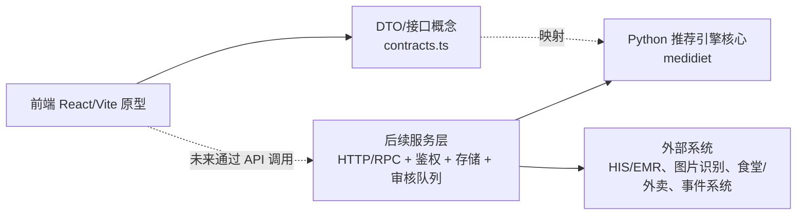
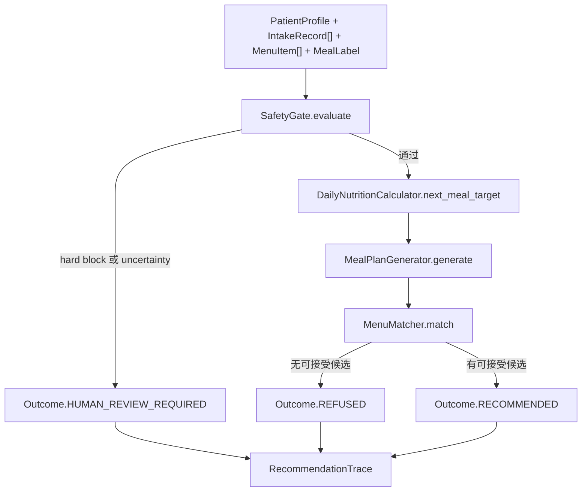

# MediDiet 前后端使用与功能边界文档

版本：0.1.0
适用对象：产品演示、研发评审、测试验收、后续接口对接讨论。

## 1. 文档定位

本项目当前由两部分组成：

- 前端：`apps/mini-program-prototype`，一个 React/Vite 实现的微信小程序移动端原型。
- 后端：`src/medidiet`，一个 Python 推荐引擎核心包。

当前项目尚不是完整的生产系统。前端没有连接真实 HTTP API；后端也没有启动 Web 服务、数据库、登录鉴权、图片识别或外卖/食堂生产连接器。两者通过一致的数据概念和 DTO 形状表达同一套业务闭环，用于展示功能、验证边界，并为后续服务化对接提供契约基础。

## 2. 快速演示入口

### 2.1 前端原型启动

```bash
cd apps/mini-program-prototype
npm install
npm run dev -- --host 127.0.0.1
```

浏览器访问：

```text
http://127.0.0.1:5173/
```

常用检查命令：

```bash
npm run test
npm run build
```

### 2.2 后端核心 demo

在仓库根目录运行：

```bash
PYTHONPATH=src python -m medidiet.cli
```

输出是一段 JSON trace，包含推荐结果、规则版本、分数、安全事件、排除项和解释文本。

后端测试：

```bash
PYTHONPATH=src python -m unittest discover -s tests -v
```

## 3. 一句话架构



前端现在消费本地 fixture 和状态机；后端现在暴露 Python API 和扩展端口。真正联调时，应在二者之间新增服务层，由服务层完成鉴权、请求校验、数据适配、trace 持久化和人工审核队列。

## 4. 前端使用文档

### 4.1 前端定位

前端原型用于展示同一个小程序中的三类角色入口和核心工作流：

- 患者：查看健康资料、补录今日摄入、获取下一餐推荐、查看拒绝或待审核状态。
- 营养师：查看待审核队列、阅读 trace 证据链、确认/修改/驳回推荐。
- 配餐管理人员：查看菜单数据、维护可售状态、查看营养质量、处理轻量备餐状态。

当前实现是浏览器中的移动端原型，不是微信小程序原生项目。

### 4.2 主要文件

| 文件 | 作用 |
| --- | --- |
| `apps/mini-program-prototype/src/App.tsx` | 页面总入口，负责角色切换和三类工作台渲染。 |
| `apps/mini-program-prototype/src/contracts.ts` | 前端 DTO、枚举和辅助映射。 |
| `apps/mini-program-prototype/src/fixtures.ts` | 演示数据，包括患者、摄入、菜单、推荐、审核和履约。 |
| `apps/mini-program-prototype/src/state.ts` | 本地状态机，模拟接口返回和角色间状态流转。 |
| `apps/mini-program-prototype/src/features/patient/PatientWorkspace.tsx` | 患者工作台。 |
| `apps/mini-program-prototype/src/features/review/DietitianWorkspace.tsx` | 营养师审核工作台。 |
| `apps/mini-program-prototype/src/features/catering/CateringWorkspace.tsx` | 配餐管理工作台。 |

### 4.3 患者端功能

患者端默认展示：

- 今日概览：今日摄入数量和推荐状态数量。
- 晚餐前提示：强调低钠、控糖、足量蛋白等演示目标。
- 健康资料：患者姓名、慢病、过敏、口味偏好、预算、关键风险字段确认状态。
- 今日摄入：展示摄入食物、餐次、份量、置信度和钠含量。
- 推荐结果：展示推荐成功、拒绝推荐或等待营养师审核三种状态。

可操作动作：

- `获取下一餐推荐`：恢复演示中的正常推荐结果。
- `手动补录低糖酸奶`：新增一条患者手动补录的摄入记录。
- `模拟拒绝推荐`：展示候选餐食不满足要求时的拒绝状态。
- `模拟等待营养师审核`：展示进入人工审核队列的状态。

展示边界：

- 当前补录内容固定为“低糖酸奶”，不是完整食物搜索或拍照识别流程。
- 当前推荐结果来自本地 fixture，不会调用后端引擎。
- 当前健康资料不是从 HIS/EMR 或真实患者档案读取。
- 患者侧只展示解释和状态，不承担临床规则计算。

### 4.4 营养师端功能

营养师端用于展示人工审核闭环：

- 待审核队列：展示患者、餐次、风险等级、待审原因和 trace id。
- Trace 证据链：展示 outcome、risk、safety、rule、exclusions、scores、排除项、评分、命中标签、患者解释和 LLM 边界说明。
- 审核动作：支持确认推荐、修改推荐、驳回推荐。

审核动作对患者侧的影响：

| 审核动作 | 患者侧结果 |
| --- | --- |
| 确认推荐 | 状态变为已生成推荐，展示“营养师已确认”的解释。 |
| 修改推荐 | 状态变为已生成推荐，展示“营养师已调整”的解释。 |
| 驳回推荐 | 状态变为拒绝推荐，展示“营养师未通过”的解释。 |

展示边界：

- 当前队列只有本地模拟数据，没有真实多患者列表、分页、筛选或分派。
- 当前修改推荐只是状态与文案模拟，不包含可编辑处方、替换菜品或保存审核意见。
- Trace 证据链只展示结构化字段，不在前端重新推导规则。
- 营养师权限、机构权限、审计日志和电子签名尚未实现。

### 4.5 配餐管理端功能

配餐端用于展示推荐候选池和履约状态的最小闭环：

- 菜单列表：展示菜品名称、价格、营养置信度、营养标签和可售状态。
- 下架菜品：点击 `下架清蒸鱼套餐` 后，首个菜品变为下架。
- 营养详情：展示能量、碳水、蛋白质、钠。
- 轻量履约：展示已确认餐食，支持将待准备状态改为已备餐。

展示边界：

- 当前不支持新增/编辑完整菜单字段。
- 当前只支持下架首个菜品，不支持重新上架、批量操作或门店库存。
- 当前履约状态只演示待准备到已备餐，不包含接单、配送、取餐码、取消退款或异常处理。
- 营养数据质量只通过置信度和部分字段体现，没有接入真实营养标注后台。

### 4.6 前端接口概念

前端契约集中在 `contracts.ts`：

| DTO | 用途 |
| --- | --- |
| `PatientProfileDto` | 患者画像、疾病、过敏、偏好、预算和风险字段确认状态。 |
| `IntakeRecordDto` | 摄入记录，包含餐次、份量、营养估算、置信度和来源。 |
| `MenuItemDto` | 菜单菜品，包含营养、标签、禁忌、价格、距离、可售状态和数据来源。 |
| `RecommendationResponseDto` | 推荐响应，包含 outcome、风险、推荐项、患者解释、审核状态和 trace。 |
| `RecommendationTraceDto` | 证据链，包含 safety events、exclusions、scores 和 clinician explanation。 |
| `ReviewCaseDto` | 营养师审核队列项。 |
| `FulfillmentDto` | 配餐履约状态。 |

后续真实接口建议保持这些职责边界：前端读取结构化结果并提交用户动作，不在前端计算医学规则、营养阈值或安全阻断。

## 5. 后端使用文档

### 5.1 后端定位

后端当前是推荐引擎核心包 `medidiet`，不是 HTTP 服务。它负责：

- 定义患者、摄入、菜单、营养、规则、结果和 trace 等核心领域模型。
- 校验输入类型和基础数值边界。
- 加载 baseline 规则包。
- 执行安全门禁、下一餐营养目标计算、餐食计划生成、菜单匹配排序。
- 输出患者解释、医生/营养师解释和可审计 trace。
- 定义外部系统接入端口和领域事件结构。

### 5.2 公共 API

顶层可稳定导入：

```python
from medidiet import RecommendationEngine, RecommendationResult, RulePack, load_baseline_rule_pack
```

最小调用：

```python
from medidiet import RecommendationEngine, load_baseline_rule_pack
from medidiet.fixtures import DEMO_NOW, demo_request

rule_pack = load_baseline_rule_pack()
patient, intake_records, menu_items, meal_label = demo_request()

result = RecommendationEngine(rule_pack, now=DEMO_NOW).recommend(
    patient=patient,
    intake_records=intake_records,
    candidate_menu_items=menu_items,
    meal_label=meal_label,
)

print(result.outcome.value)
print(result.patient_explanation)
print(result.trace.to_json())
```

### 5.3 推荐主流程



当前结果类型：

| Outcome | 触发条件 | 返回推荐项 |
| --- | --- | --- |
| `recommended` | 安全门禁通过，且 matcher 找到可接受候选。 | 返回排序最高的 1 个菜单项。 |
| `refused` | 安全门禁通过，但所有候选被排除。 | 不返回菜单项。 |
| `human_review_required` | 安全门禁出现 hard block 或 uncertainty。 | 不返回菜单项。 |
| `downgraded` | 枚举已预留。 | 当前引擎不会主动返回。 |

### 5.4 安全门禁

`SafetyGate` 会把以下情况转为人工审核：

| Code | 类型 | 含义 |
| --- | --- | --- |
| `1001 OUT_OF_SCOPE_NON_ADULT` | hard block | 非成人，超出当前 MVP 范围。 |
| `1002 ALLERGY_MATCH` | hard block | 菜品命中患者过敏原。 |
| `1003 CONTRAINDICATION_MATCH` | hard block | 患者禁忌与疾病规则硬排除命中。 |
| `1004 NUTRIENT_LIMIT_EXCEEDED` | hard block | 菜品单餐营养值超过规则上限。 |
| `2001 PATIENT_PROFILE_UNCONFIRMED` | uncertainty | 关键风险字段未确认。 |
| `2002 LOW_CONFIDENCE_INTAKE` | uncertainty | 摄入记录低置信度且未人工修正。 |
| `2003 LOW_CONFIDENCE_MENU` | uncertainty | 菜单营养置信度低。 |

日志边界：

- 默认使用 `NullHandler`，不会向 stderr 打 warning。
- 传入 `log_file_path` 时才写安全 warning 日志。
- 日志只作为审计辅助，业务逻辑不得解析日志文本。

### 5.5 规则与营养计算

baseline 规则包版本：

```text
baseline-2026-05-15
```

当前覆盖疾病/目标：

- `hypertension`
- `diabetes`
- `hyperlipidemia`
- `weight_control`

规则能力：

- 疾病相关硬排除标签，例如高钠、含糖饮料、甜品、油炸、肥肉、大份量。
- 推荐营养标签，例如低钠、控主食、高纤维、优质蛋白、蔬菜丰富、均衡搭配。
- 单餐、每日和滚动窗口营养上限。

边界：

- 当前阈值是 baseline demo，生产前必须由临床营养师或医生审核。
- 多疾病规则冲突优先级尚未产品化。
- 规则版本选择、灰度发布和回滚不在核心包内完成。

### 5.6 菜单匹配与排序

`MenuMatcher` 会排除：

- 不可售菜品。
- 命中餐食计划 avoid tag 的菜品。
- 超过单餐剩余额度的菜品。

排序因素：

- 命中 required nutrition tags 的数量。
- 命中患者 taste tags 的数量。
- 商家可靠性。
- 是否符合价格上限。
- 是否符合距离上限。
- 价格和距离的轻量加分。

边界：

- 当前只返回分数最高的 1 个菜品。
- `disliked_ingredients` 当前还没有作为硬排除或降权条件。
- 没有真实库存、配送时效、门店营业时间或并发抢单逻辑。
- 没有学习用户长期偏好或个性化模型。

### 5.7 Trace 与解释

`RecommendationTrace.to_dict()` 和 `to_json()` 使用 camelCase 输出，核心字段包括：

- `traceId`
- `patientId`
- `ruleVersion`
- `outcome`
- `riskLevel`
- `createdAt`
- `safetyEvents`
- `exclusions`
- `scores`
- `patientExplanation`
- `clinicianExplanation`

隐私边界：

- 当前 trace 包含内部 `patientId`。
- 当前 trace 不包含姓名、手机号、身份证、原始病历文本、原始图片或地址。
- 生产服务层仍需补充患者 ID 哈希化、访问控制、审计留存和敏感字段脱敏策略。

解释边界：

- 患者解释来自固定模板和规则命中信息。
- 医生/营养师解释是结构化字段，不依赖自然语言解析。
- `llmBoundary` 明确说明解释只能来自规则命中、营养事实和候选评分。
- 当前后端没有调用大模型生成医学建议。

### 5.8 扩展端口

`src/medidiet/ports.py` 预留了后续服务化端口：

| 端口 | 建议接入对象 |
| --- | --- |
| `PatientContextPort` | HIS/EMR、患者档案、小程序患者绑定服务。 |
| `IntakeEstimatorPort` | 图片识别、手动补录、营养估算服务。 |
| `MenuProviderPort` | 食堂、外卖、门店菜单和营养标注服务。 |
| `EventPublisherPort` | 消息队列、审核系统、审计日志或监控平台。 |

这些是 Python `Protocol` 和数据结构定义，不是已经实现的外部连接器。

## 6. 前后端对接建议

后续真正联调时，建议新增服务层，而不是让前端直接调用 Python 包。服务层建议职责：

- 鉴权、登录态、角色权限、患者授权。
- 请求 id、幂等、schema version、source system。
- 原始 HTTP payload 到核心 dataclass 的转换。
- 外部图片识别和菜单系统适配。
- `RecommendationEngine.recommend()` 调用。
- trace 持久化和安全审计。
- `human_review_required` 写入审核队列。
- 营养师审核结果回写患者侧推荐状态。
- 领域事件发布和监控告警。

建议接口分组：

| 场景 | 前端动作 | 服务层职责 | 后端核心职责 |
| --- | --- | --- | --- |
| 获取患者工作台 | 读取健康资料、摄入、推荐状态 | 鉴权并聚合患者数据 | 无直接调用或加载领域模型 |
| 提交摄入补录 | 保存手动补录或图片识别结果 | 转换成 `IntakeRecord` 并记录来源 | 校验数据结构 |
| 获取下一餐推荐 | 发起推荐请求 | 加载患者、摄入、菜单并调用引擎 | 输出 recommendation result 和 trace |
| 查看审核队列 | 营养师读取待审记录 | 查询 `human_review_required` 队列 | trace 提供证据链 |
| 提交审核动作 | 确认/修改/驳回 | 写审核记录并回写患者推荐状态 | 不直接处理权限或队列 |
| 菜单维护 | 下架、更新营养信息 | 同步菜单服务并记录审计 | 后续通过 `MenuProviderPort` 消费 |

## 7. 推荐演示脚本

### 7.1 前端功能闭环演示

1. 打开前端原型，默认进入患者工作台。
2. 展示今日概览、健康资料、今日摄入和默认推荐结果。
3. 点击 `手动补录低糖酸奶`，说明患者可以补充或修正摄入信息。
4. 点击 `模拟等待营养师审核`，说明低置信度、高风险或资料不完整时不会直接给出自动推荐。
5. 切换到 `营养师`，展示待审核队列和 trace 证据链。
6. 点击 `确认推荐`，说明审核结果会回写患者侧。
7. 切回 `患者`，确认推荐状态变为已生成推荐。
8. 切换到 `配餐`，展示菜单可售状态、营养置信度和备餐状态。
9. 点击 `下架清蒸鱼套餐` 和 `标记已备餐`，说明菜单维护与履约只是轻量原型。

### 7.2 后端能力演示

1. 运行 `PYTHONPATH=src python -m medidiet.cli`。
2. 展示输出 JSON 中的 `outcome`、`ruleVersion`、`scores`、`patientExplanation` 和 `clinicianExplanation`。
3. 说明 `traceId` 每次运行不同，便于审计追踪。
4. 运行全量 Python 测试，说明推荐、拒绝、人工审核、安全 code、trace 序列化和端口契约已有测试覆盖。

### 7.3 边界说明话术

可以直接使用以下口径：

> 当前版本前端用于验证三类角色的信息架构和审核闭环；后端用于验证推荐引擎核心规则、trace 和扩展端口。它们还没有被一个真实服务层连接起来，因此不能把当前页面理解为生产小程序，也不能把 Python 包理解为可直接部署的 HTTP API。

## 8. 验收清单

前端演示验收：

- 能启动 Vite 原型并进入 `MediDiet 角色工作台`。
- 能在患者、营养师、配餐三类角色之间切换。
- 患者侧能展示推荐、拒绝、待审核三种状态。
- 营养师侧能展示 trace 证据链并提交三类审核动作。
- 审核结果能回写到患者侧。
- 配餐侧能展示菜单质量、下架菜品和标记已备餐。
- `npm run test` 和 `npm run build` 通过。

后端演示验收：

- `PYTHONPATH=src python -m medidiet.cli` 能输出 trace JSON。
- `PYTHONPATH=src python -m unittest discover -s tests -v` 通过。
- 推荐成功、拒绝推荐、人工审核三条主路径都有测试覆盖。
- 安全事件和菜单排除原因使用整数 code。
- `MealLabel`、`DataSource`、`ConceptCode` 等核心字段不依赖自由文本。
- trace 输出为 camelCase，且不包含姓名、手机号、身份证、原始图片等敏感字段。

生产化前必须补齐：

- 前后端 HTTP/RPC 服务层。
- 登录、鉴权、角色权限和患者授权。
- 数据库、trace 持久化、审核队列和审计日志。
- HIS/EMR、图片识别、食堂/外卖菜单适配器。
- 临床规则审核、规则版本管理、灰度发布和回滚。
- 隐私合规、脱敏、日志留存、监控告警和故障降级。
