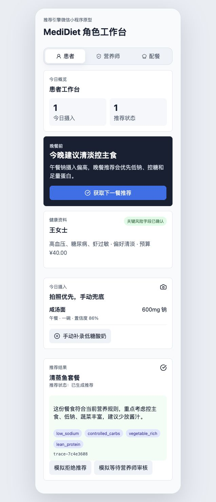
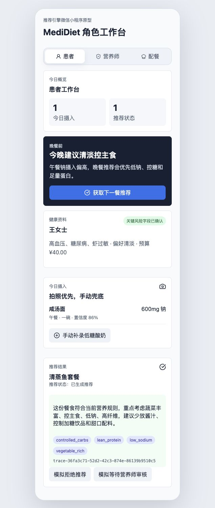
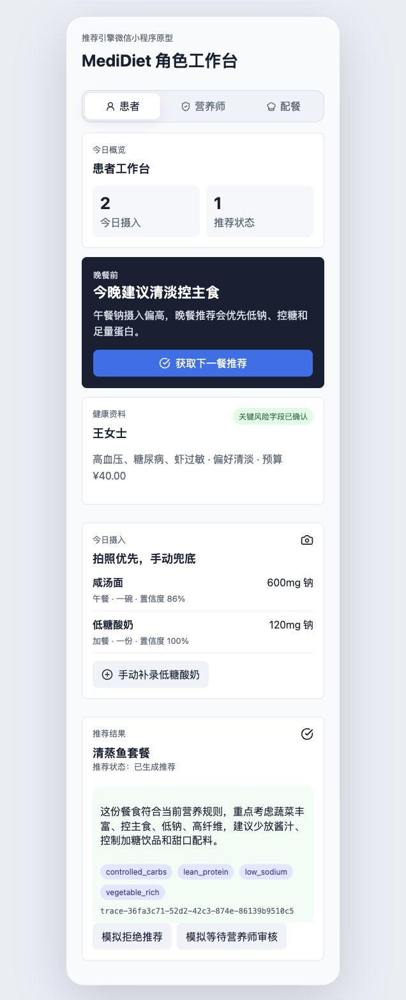
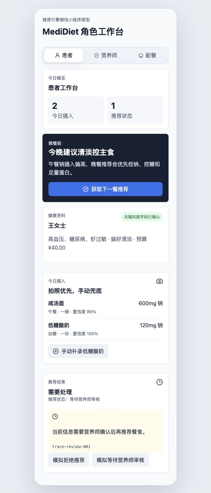
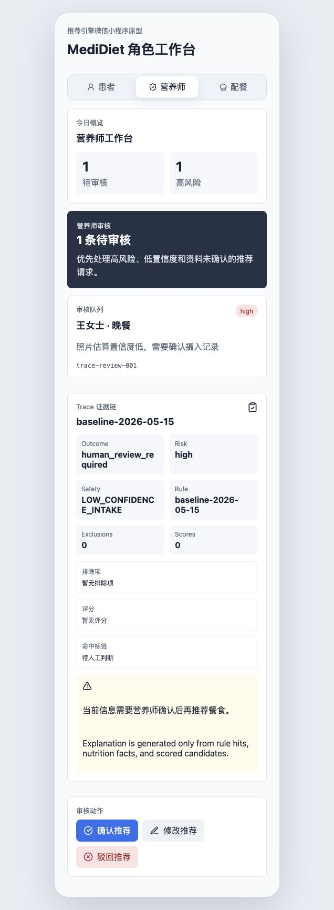
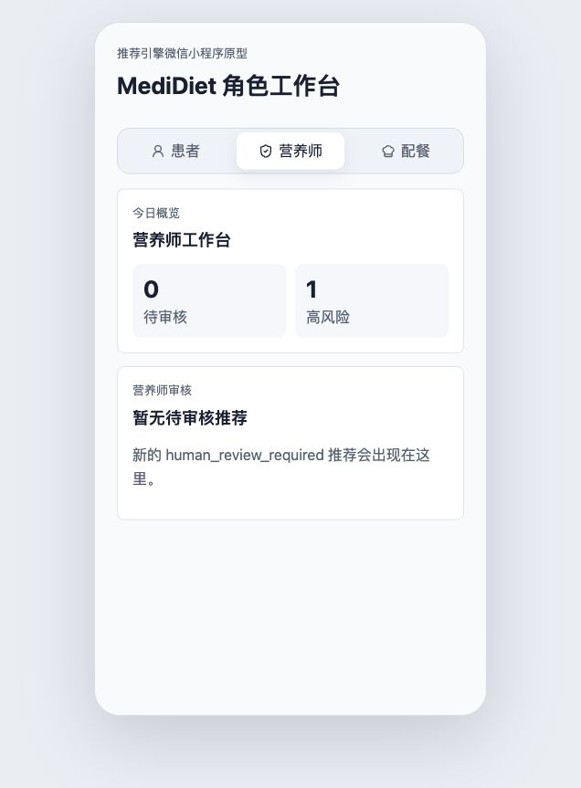
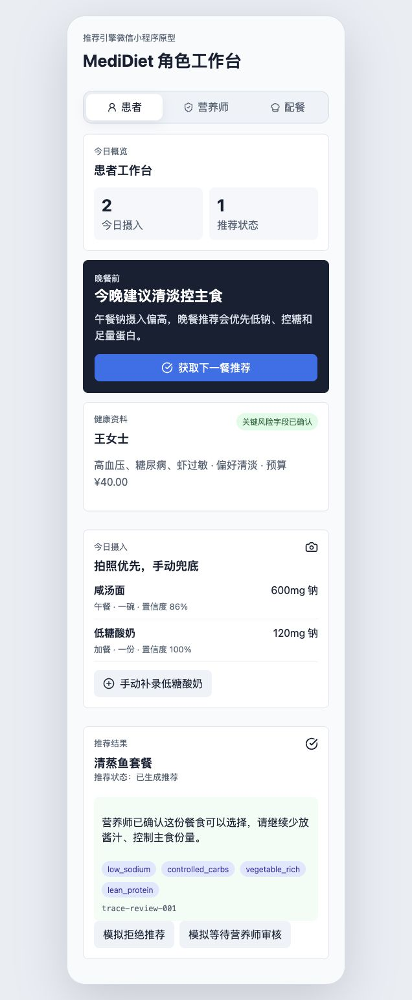
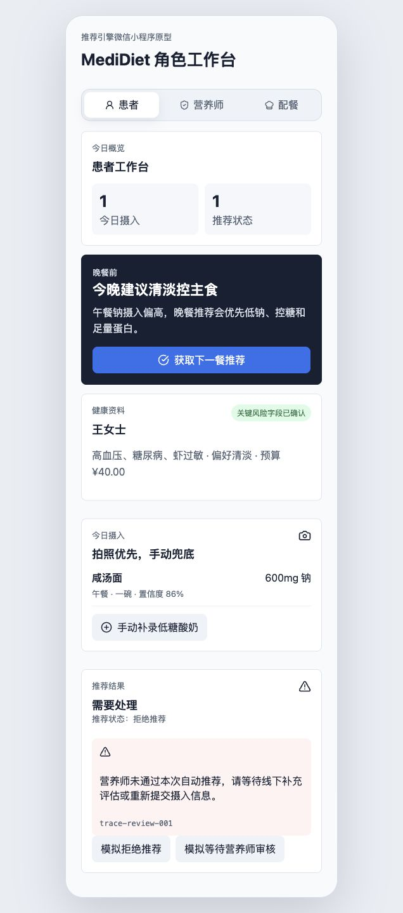
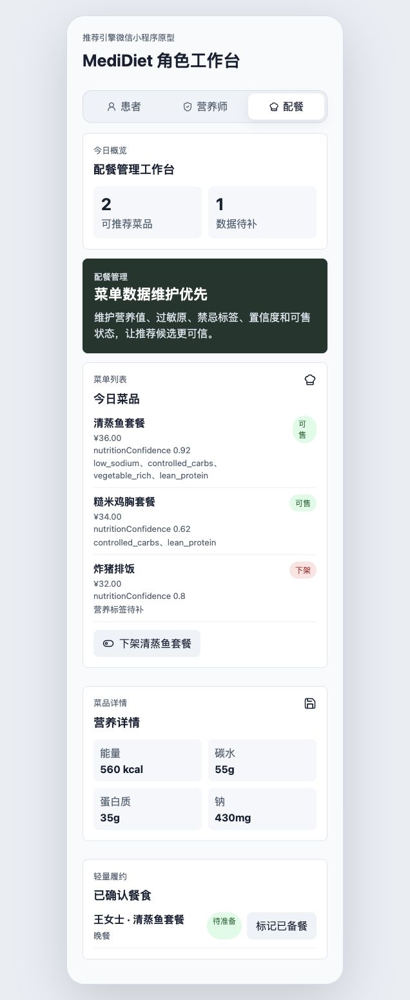
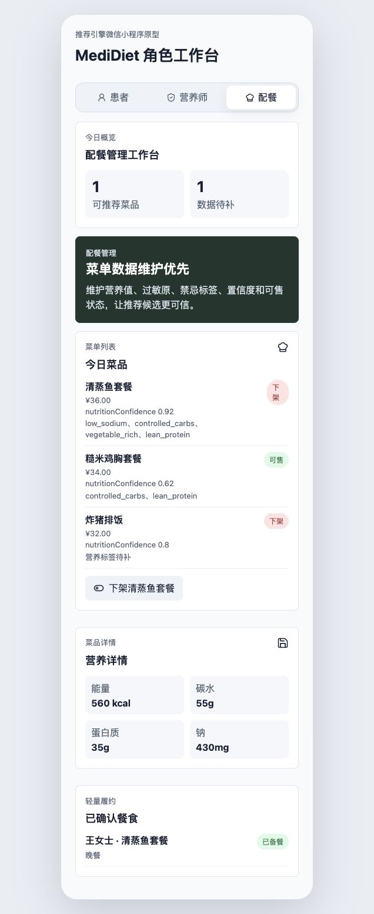

# MediDiet 前端端到端功能验证结果

验证日期：2026-05-19  
验证对象：推荐引擎微信小程序前端原型  
前端地址：`http://127.0.0.1:5173/`  
后端地址：`http://127.0.0.1:8000/`  
代码版本：`aa8ca6f`  
验证方式：浏览器端到端操作 + 大模型辅助语义检查 + 前端截图证据

## 1. 验证环境

后端健康检查结果：

```json
{"status":"ok","version":"0.1.1","ruleVersion":"baseline-2026-05-15"}
```

浏览器截图保存目录：

```text
docs/assets/frontend-e2e-results/2026-05-19/
```

本次验证覆盖：

- 患者端初始加载
- 患者端调用后端推荐
- 患者端手动补录摄入
- 患者端进入等待营养师审核
- 营养师端查看待审核队列和 Trace
- 营养师端确认推荐
- 患者端查看营养师确认结果
- 营养师端驳回推荐后患者端查看拒绝结果
- 配餐端查看菜单质量与履约状态
- 配餐端下架菜品并标记已备餐

## 2. 总体验证结论

本次端到端验证通过。

关键通过证据：

- 前端页面可以在浏览器中正常加载。
- 三类角色入口均可切换。
- 患者端“获取下一餐推荐”可以触发后端推荐链路，并展示非本地初始 trace。
- 患者端补录摄入后，今日摄入数量和列表内容发生更新。
- 等待营养师审核状态可以从患者端进入营养师端队列。
- 营养师确认后，患者端可以看到确认后的推荐解释。
- 营养师驳回后，患者端可以看到“拒绝推荐”结果。
- 配餐端可以展示菜单质量、下架菜品并更新履约状态。

大模型辅助语义检查结论：

- 患者端推荐、等待审核和拒绝推荐状态表达清楚。
- 营养师端 Trace 信息具备审核可读性。
- 配餐端菜单质量、可售状态和履约动作表达清楚。
- 当前页面未出现明显越界医学承诺。

## 3. 步骤 1：患者工作台初始加载

操作：

1. 打开 `http://127.0.0.1:5173/`。
2. 确认默认进入“患者”角色。

通过标准：

- 页面显示“MediDiet 角色工作台”。
- 顶部角色入口包含“患者”“营养师”“配餐”。
- 当前页面显示“患者工作台”。
- 患者资料、今日摄入和推荐结果区域可见。

实际结果：通过。

截图证据：



## 4. 步骤 2：患者端获取后端推荐成功

操作：

1. 在患者工作台点击“获取下一餐推荐”。
2. 等待推荐结果刷新。

通过标准：

- 页面显示“推荐状态：已生成推荐”。
- 页面显示推荐餐食“清蒸鱼套餐”。
- trace id 已从本地初始值 `trace-7c4e3608` 更新为后端返回的动态 trace。
- 页面未出现“推荐服务暂不可用”。

实际结果：通过。

截图证据：



## 5. 步骤 3：患者端手动补录摄入成功

操作：

1. 在患者工作台点击“手动补录低糖酸奶”。
2. 查看今日摄入列表。

通过标准：

- 今日摄入数量从 `1` 更新为 `2`。
- 今日摄入列表新增“低糖酸奶”。
- 新增记录展示餐次、份量、置信度和钠含量。

实际结果：通过。

截图证据：



## 6. 步骤 4：患者端进入等待营养师审核状态

操作：

1. 在患者工作台点击“模拟等待营养师审核”。
2. 查看推荐结果区域。

通过标准：

- 推荐状态变为“等待营养师审核”。
- 页面提示当前推荐需要营养师确认。
- 患者端仍然保留 trace id，方便后续追溯。

实际结果：通过。

截图证据：



## 7. 步骤 5：营养师端查看待审核队列和 Trace

操作：

1. 点击顶部“营养师”入口。
2. 查看待审核队列和 Trace 证据链。

通过标准：

- 页面显示“营养师工作台”。
- 页面显示待审核推荐。
- 页面展示风险等级、待审原因和 trace id。
- Trace 区域展示 outcome、risk、safety、rule、scores 等审核证据。
- 页面提供“确认推荐”“修改推荐”“驳回推荐”三个审核动作。

实际结果：通过。

截图证据：



## 8. 步骤 6：营养师确认推荐成功

操作：

1. 在营养师工作台点击“确认推荐”。
2. 查看审核队列状态。

通过标准：

- 操作后待审核队列清空。
- 页面显示“暂无待审核推荐”。
- 审核动作不再展示为可处理队列项。

实际结果：通过。

截图证据：



## 9. 步骤 7：患者端展示营养师确认后的推荐

操作：

1. 营养师确认推荐后，切回“患者”。
2. 查看推荐结果区域。

通过标准：

- 页面显示“推荐状态：已生成推荐”。
- 推荐餐食仍为“清蒸鱼套餐”。
- 推荐解释包含营养师确认后的说明。
- trace id 更新为审核链路 trace。

实际结果：通过。

截图证据：



## 10. 步骤 8：营养师驳回后患者端展示拒绝推荐

操作：

1. 重新进入营养师审核场景。
2. 点击“驳回推荐”。
3. 切回“患者”。

通过标准：

- 患者端推荐结果标题显示“需要处理”。
- 页面显示“推荐状态：拒绝推荐”。
- 页面解释包含营养师未通过原因。

实际结果：通过。

截图证据：



## 11. 步骤 9：配餐端菜单质量和履约初始状态

操作：

1. 点击顶部“配餐”入口。
2. 查看配餐管理工作台。

通过标准：

- 页面显示“配餐管理工作台”。
- 菜单列表展示菜品名称、价格、营养置信度、营养标签和可售状态。
- 营养详情展示能量、碳水、蛋白质、钠。
- “已确认餐食”区域展示当前履约状态。

实际结果：通过。

截图证据：



## 12. 步骤 10：配餐端下架菜品并标记已备餐

操作：

1. 在配餐端点击“下架清蒸鱼套餐”。
2. 点击“标记已备餐”。
3. 查看菜单和履约状态。

通过标准：

- “清蒸鱼套餐”状态从可售变为下架。
- 操作按钮变为“上架清蒸鱼套餐”。
- 履约状态显示“已备餐”。

实际结果：通过。

截图证据：



## 13. 遗留风险

本次验证是前端原型级端到端验证，不代表生产完备性。

仍需后续补充：

- 真实微信小程序运行时验证。
- 生产角色权限和鉴权验证。
- 真实后端持久化后的重复点击、并发和异常恢复验证。
- 大模型验收脚本自动化落地，而不是仅作为人工辅助检查。
- 移动端多尺寸截图验证。
- 无障碍和弱网场景验证。

## 14. 结论

截至 2026-05-19，本次前端端到端功能验证通过。截图证据已随报告保存，可用于产品评审、联调记录和后续回归测试基线。
