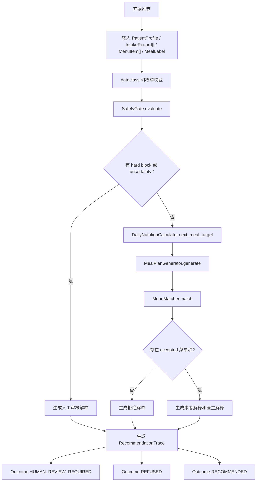
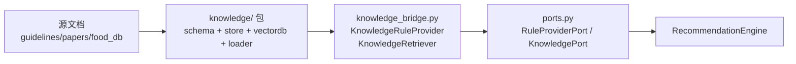
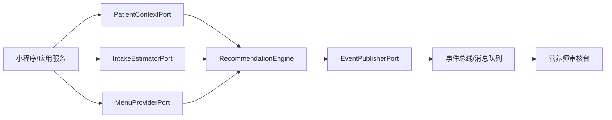

# MediDiet 软件设计文档

版本：0.1.3
目标读者：代码 reviewer、后续重构开发者、接口扩展开发者、测试负责人。

## 1. 设计目标

MediDiet 当前实现的是医院餐食推荐 agent 的核心推荐引擎。它以规则为主，结合患者资料、今日摄入、菜单候选项和偏好，输出下一餐推荐、解释和可审计 trace。

核心设计目标：

- 安全优先：过敏、禁忌、低置信度和越界场景先进入安全门禁。
- 规则优先：慢病营养约束来自版本化规则包，不由自然语言或 LLM 决定。
- 可扩展：图片识别、外卖/食堂平台、HIS/EMR、事件发布通过端口接入。
- 可审计：所有推荐输出都带 trace、枚举 code、规则版本、分数和排除原因。
- 可测试：领域模型、规则、门禁、营养计算、规划、匹配、解释、编排、端口均有单元测试。

## 2. 目录架构

```text
MediDiet/
├── docs/
│   ├── api.md
│   ├── software-design.md
│   ├── testing.md
│   ├── usage.md
│   └── superpowers/
│       ├── plans/
│       └── specs/
├── knowledge/                           # 独立知识库包
│   ├── pyproject.toml
│   ├── source_documents/                  # 知识库源文档
│   │   ├── guidelines/
│   │   ├── papers/
│   │   └── food_db/
│   ├── src/knowledge/
│   │   ├── schema.py                    # 知识库数据模型
│   │   ├── store.py                     # 规则存储与版本化
│   │   ├── documents.py                 # 文档导入与分块
│   │   ├── vectordb.py                  # ChromaDB 向量存储
│   │   ├── loader.py                    # 批量文档导入
│   │   └── extractor.py                 # LLM 规则提取（Phase 2）
│   └── tests/
├── scripts/
│   └── render_chinese_spec_pdf.py
├── src/
│   └── medidiet/
│       ├── __init__.py
│       ├── cli.py
│       ├── domain.py
│       ├── engine.py
│       ├── explainer.py
│       ├── fixtures.py
│       ├── knowledge_bridge.py          # 知识库端口适配器
│       ├── llm.py
│       ├── matcher.py
│       ├── nutrition.py
│       ├── planner.py
│       ├── ports.py
│       ├── rules.py
│       ├── safety.py
│       ├── server.py
│       ├── service.py
│       └── trace.py
├── tests/
│   ├── test_domain.py
│   ├── test_engine.py
│   ├── test_explainer_trace.py
│   ├── test_knowledge_bridge.py         # 知识库桥接测试
│   ├── test_knowledge_integration.py    # 知识库端到端集成测试
│   ├── test_llm.py
│   ├── test_llm_deepseek_smoke.py
│   ├── test_http_server.py
│   ├── test_matcher.py
│   ├── test_nutrition.py
│   ├── test_planner.py
│   ├── test_ports.py
│   ├── test_public_api.py
│   ├── test_rules.py
│   ├── test_service.py
│   └── test_safety.py
└── pyproject.toml
```

## 3. 模块职责

| 模块 | 职责 | 主要类/函数 |
| --- | --- | --- |
| `domain.py` | 领域模型、枚举、基础校验。 | `PatientProfile`, `IntakeRecord`, `MenuItem`, `ConceptCode`, `MealLabel` |
| `rules.py` | 版本化规则包、概念注册表、营养限制。 | `RulePack`, `ConditionRule`, `NutrientLimit`, `load_baseline_rule_pack` |
| `safety.py` | 安全门禁、阻断/不确定性事件、warning 日志。 | `SafetyGate`, `SafetyEvent`, `SafetyCode` |
| `nutrition.py` | 今日摄入聚合、下一餐剩余营养目标。 | `DailyNutritionCalculator`, `NextMealTarget` |
| `planner.py` | 把营养目标转换为下一餐计划。 | `MealPlanGenerator`, `MealPlan`, `MealInstruction` |
| `matcher.py` | 菜单候选项硬排除和排序。 | `MenuMatcher`, `MatchResult`, `MatchRejectionCode` |
| `explainer.py` | 患者解释和医生/营养师结构化解释。 | `ExplanationBuilder` |
| `trace.py` | 推荐 trace 序列化。 | `RecommendationTrace` |
| `engine.py` | 推荐流程编排。 | `RecommendationEngine`, `RecommendationResult` |
| `llm.py` | 推荐后的可选 LLM 解释增强、推荐范围内问答、上下文脱敏和 OpenAI-compatible provider。 | `LLMContextSanitizer`, `LLMExplanationEnhancer`, `LLMQuestionAnswerer`, `OpenAICompatibleLLMProvider` |
| `service.py` | HTTP 工作流的内存应用服务、DTO 转换和推荐编排。 | `RecommendationService`, `InMemoryRecommendationStore` |
| `server.py` | FastAPI adapter、HTTP payload 模型和统一错误映射。 | `create_app`, `app` |
| `ports.py` | 外部系统扩展端口、事件契约、知识库端口协议。 | `RecommendationRequestEnvelope`, `DomainEvent`, `KnowledgeSnippet`, `KnowledgeContext`, `RuleProviderPort`, `KnowledgePort`, `*Port` |
| `knowledge_bridge.py` | 知识库端口适配器（连接 `knowledge` 包与引擎的唯一入口）。 | `KnowledgeRuleProvider`, `KnowledgeRetriever` |
| `fixtures.py` | deterministic demo 数据。 | `demo_request`, `DEMO_NOW` |
| `cli.py` | 本地 demo CLI。 | `main` |

### 知识库模块（`knowledge/` 独立包）

| 模块 | 职责 | 主要类/函数 |
| --- | --- | --- |
| `schema.py` | 知识库数据模型：文档、分块、候选规则、交叉验证结果。 | `KnowledgeDocument`, `DocumentChunk`, `ExtractedConditionRule`, `VerificationResult` |
| `store.py` | 结构化规则 CRUD、JSON 文件版本化。 | `RuleStore` |
| `documents.py` | 文档导入、段落分块、元数据管理。 | `DocumentImporter` |
| `vectordb.py` | ChromaDB 向量存储、语义搜索。 | `KnowledgeVectorDB` |
| `loader.py` | 从 `knowledge/source_documents/` 批量导入文档并可选索引。 | `KnowledgeLoader` |
| `extractor.py` | LLM 规则提取（Phase 2 实现）。 | （预留） |

## 4. 总体架构

```mermaid
flowchart LR
  app["小程序/前端"]
  http["FastAPI HTTP Server"]
  service["RecommendationService"]
  patientPort["PatientContextPort"]
  intakePort["IntakeEstimatorPort"]
  menuPort["MenuProviderPort"]
  eventPort["EventPublisherPort"]
  engine["RecommendationEngine"]
  safety["SafetyGate"]
  nutrition["DailyNutritionCalculator"]
  planner["MealPlanGenerator"]
  matcher["MenuMatcher"]
  explainer["ExplanationBuilder"]
  llm["Optional LLM Post-Processor"]
  sanitizer["LLMContextSanitizer"]
  llmProvider["OpenAICompatibleLLMProvider"]
  trace["RecommendationTrace"]
  rules["RulePack + ConceptRegistry"]

  app --> http --> service
  service --> engine
  app --> patientPort
  app --> intakePort
  app --> menuPort
  patientPort --> engine
  intakePort --> engine
  menuPort --> engine
  rules --> engine
  engine --> safety
  engine --> nutrition
  engine --> planner
  engine --> matcher
  engine --> explainer
  engine --> trace
  engine --> sanitizer
  sanitizer --> llm
  llmProvider --> llm
  llm --> app
  trace --> eventPort
  engine --> service --> http --> app
```



LLM 只位于推荐后的后处理路径。`LLMContextSanitizer` 先基于 `RecommendationResult` 构造脱敏上下文，`LLMExplanationEnhancer` 可增强解释，`LLMQuestionAnswerer` 只回答本次推荐范围内的问题，`OpenAICompatibleLLMProvider` 负责 DeepSeek/OpenAI-compatible 接口调用。LLM 不参与菜单选择，也不能改写 outcome、排除原因、评分或安全事件。

设计说明：

- 外部系统只负责准备结构化输入，不直接决定推荐结果。
- `RecommendationEngine` 是应用层编排器，内部组件都可独立测试。
- `RulePack` 是规则和概念的唯一来源。扩展疾病或禁忌时优先改规则包。
- `RecommendationTrace` 是审计出口，面向测试、review、人工审核和后续事件发布。

## 5. 推荐流程图



关键分支：

- 安全门禁触发任何 hard block 或 uncertainty 时，不进入菜单排序，直接人工审核。
- 菜单匹配阶段若所有候选都被排除，返回拒绝推荐。
- 推荐成功时只返回排序最高的菜单项，trace 仍保留所有 accepted 分数和 excluded 原因。

## 6. 核心类图


## 7. 规则与数据设计

### 7.1 概念注册表

`ConceptRegistry` 将疾病、过敏、禁忌、营养标签、口味标签、食材统一成 `ConceptCode`：

```text
ConceptCode(kind=CodeKind.CONDITION, value="hypertension")
ConceptCode(kind=CodeKind.ALLERGEN, value="peanut")
ConceptCode(kind=CodeKind.CONTRAINDICATION, value="high_sodium")
ConceptCode(kind=CodeKind.NUTRITION_TAG, value="low_sodium")
```

设计意图：

- 避免字符串匹配散落在业务逻辑里。
- 通过 `kind` 防止把过敏原、疾病、营养标签混用。
- 后续医院规则扩展可以新增概念定义，而不是改核心流程。

### 7.2 规则包

`RulePack` 是 table-driven 规则入口：

```text
condition -> ConditionRule
ConditionRule -> hard_exclusions + preferred_tags + nutrition_limits
```

MVP baseline：

| 疾病/目标 | hard exclusions | preferred tags | nutrient limits |
| --- | --- | --- | --- |
| 高血压 | `high_sodium` | `low_sodium`, `vegetable_rich` | 单餐钠上限 |
| 糖尿病 | `sugary_drink`, `dessert` | `controlled_carbs`, `high_fiber` | 每日糖上限、4 小时糖上限 |
| 高脂血症 | `deep_fried`, `fatty_meat` | `lean_protein`, `vegetable_rich` | 单餐脂肪上限 |
| 体重控制 | `oversized_portion` | `balanced`, `high_fiber`, `lean_protein` | 单餐能量上限 |

### 7.3 营养限额

`NutrientLimit` 支持三种 scope：

- `PER_MEAL`：直接约束下一餐候选项。
- `DAILY`：统计当天摄入后计算剩余量。
- `ROLLING_WINDOW`：按 `window_hours` 统计最近窗口摄入，例如 4 小时糖摄入上限。

`DailyNutritionCalculator` 负责把规则限制转换成 `RemainingNutrientLimit`。

### 7.4 菜单匹配

`MenuMatcher` 有两层逻辑：

1. 硬排除：
   - `available=False`
   - 命中 `MealPlan.avoid_tags`
   - 单餐候选营养值超过剩余限额
2. 排序：
   - 匹配 required nutrition tag。
   - 匹配患者 taste tag。
   - merchant reliability。
   - 价格和距离是否在偏好范围内。
   - 价格和距离的轻量连续加分。

排序公式当前是确定性启发式，后续可替换，但必须保留排除 code 和 trace。

## 8. 营养学知识库

### 8.1 设计目的

知识库是一个独立的 `knowledge/` Python 包，用于：

- 从临床指南、论文、食物数据库等非结构化文档中提取营养学规则。
- 通过 ChromaDB 向量存储提供语义搜索，支持在线检索增强解释。
- 支持三种规则摄入路径：人工整理、LLM 提取、LLM 提取 + 人工审核。
- 通过端口适配器模式与推荐引擎集成，引擎不直接依赖知识库包。

### 8.2 架构层次



依赖方向：`knowledge` 包可导入 `medidiet.domain` 和 `medidiet.rules` 的基础类型（`ConceptCode`, `NutrientLimit` 等），引擎只通过端口 Protocol 依赖知识库。`knowledge_bridge.py` 是唯一同时导入两边的模块。

### 8.3 数据模型

知识库包含三层数据模型：

| 层次 | 类型 | 说明 |
| --- | --- | --- |
| 文档层 | `KnowledgeDocument` / `DocumentChunk` | 源文档导入、段落分块（~1000 字符，~200 字符重叠）、向量化。 |
| 候选规则层 | `ExtractedConditionRule` / `VerificationResult` | LLM 提取的规则候选，含置信度、来源追溯、交叉验证结果。 |
| 生效规则层 | `ConditionRule` / `RulePack` | 经审核发布的规则，通过 `KnowledgeRuleProvider` 加载为引擎可用格式。 |

### 8.4 规则追溯

每条生效规则必须可追溯到源文档片段：

- `ExtractedConditionRule.source_doc_ids` 记录来源文档。
- `ExtractedConditionRule.source_chunk_ids` 记录具体文本片段。
- `VerificationResult.evidence_quotes` 提供规则字段对应的原文引用。

### 8.5 双模运行

| 模式 | 触发条件 | 行为 |
| --- | --- | --- |
| 离线（默认） | 未注入 `KnowledgePort` | 纯规则引擎，行为与原有完全一致。 |
| 在线增强 | 注入 `KnowledgePort` 实现 | 推荐后在 `clinician_explanation` 中附加 `knowledge_snippets`。 |

在线检索不参与规则决策（安全门禁、匹配器、评分均保持确定性），仅丰富解释。检索超时或失败静默降级，不阻断推荐。

### 8.6 知识库包 API 摘要

```python
# 规则存储
from knowledge.store import RuleStore
store = RuleStore(data_dir="data")
store.create(extracted_rule)
store.publish_version("v1.0", notes="Initial CKD rules")
store.load_version("v1.0")

# 文档导入
from knowledge.documents import DocumentImporter
importer = DocumentImporter()
doc = importer.import_from_text(doc_id="ckd-2024", title="...", source="...",
                                source_type="guideline", content="...")
doc = importer.import_from_file("knowledge/source_documents/guidelines/ckd.md")

# 向量存储
from knowledge.vectordb import KnowledgeVectorDB
vectordb = KnowledgeVectorDB(persist_dir="data/chroma")
vectordb.index_document(doc)
results = vectordb.search("sodium limit kidney disease", top_k=5)
```

### 8.7 端口适配器 API

```python
# 规则提供者（从知识库加载 RulePack）
from medidiet.knowledge_bridge import KnowledgeRuleProvider
from knowledge.store import RuleStore

provider = KnowledgeRuleProvider(store=RuleStore(), version="v1.0")
rule_pack = provider.load_rule_pack()
versions = provider.list_versions()

# 知识检索器（语义搜索 + 上下文获取）
from medidiet.knowledge_bridge import KnowledgeRetriever
from knowledge.vectordb import KnowledgeVectorDB

retriever = KnowledgeRetriever(vectordb=KnowledgeVectorDB())
snippets = retriever.search("protein restriction CKD")
context = retriever.retrieve_context(patient, meal_label)
explanation = retriever.explain_rule(condition_code)

# 引擎注入
engine = RecommendationEngine(
    rule_provider=provider,   # 替代 rule_pack
    knowledge=retriever,      # 可选在线增强
)
```

## 9. 安全设计

`SafetyGate` 在进入营养计算和菜单排序前运行。

### 8.1 hard block

- 非成人。
- 过敏原命中。
- 患者禁忌与疾病规则 hard exclusion 命中。
- 菜单候选项单餐营养值超过疾病规则硬上限。

### 8.2 uncertainty

- 患者关键风险字段未确认。
- 摄入识别低置信度且未人工修正。
- 菜单营养数据低置信度。

### 8.3 日志

- 只有 safety event 以 `WARNING` 写入。
- 默认不写 stderr。
- 显式传 `log_file_path` 时写文件，包含 timestamp、pid、tid、整数 code、规则版本。
- 业务分支使用 `SafetyEvent`，不解析日志。

## 10. 外部扩展设计



扩展原则：

- 外部适配器将外部 JSON/API 数据转换成核心 dataclass。
- 核心引擎不依赖 HTTP、数据库、对象存储、SDK；HTTP server 只作为适配层调用 `RecommendationService`。
- 外部系统错误应在适配层转换成安全拒绝、人工审核或服务层错误。
- 规则包发布、回滚、人工审核完成等动作通过 `DomainEvent` 表达。

## 11. Review 关注点

代码 review 时建议重点检查：

- 是否新增了裸字符串匹配疾病、过敏、禁忌、营养标签。
- 是否绕过 `SafetyGate` 直接推荐。
- 是否新增了非枚举的业务分支 code。
- 是否把日志文本当成业务输入。
- 是否在循环中写入大量低等级日志。
- 是否把患者隐私、原始图片或病历自由文本写入 trace/log。
- 是否对 `datetime` 使用 timezone-aware 类型。
- 是否对负值、过大值、错误枚举类型有测试。
- 是否保持 `RecommendationTrace` 可审计。

## 12. 已知限制

- 当前 HTTP API server 使用内存状态，仅用于本地或可信内网联调。
- 当前没有真实图片识别、外卖平台、HIS/EMR 适配器。
- baseline 规则阈值是演示级，需要临床审核后才能用于生产。
- 当前 `DOWNGRADED` outcome 预留但未由引擎主动产生。
- 当前只推荐排序最高的一项；多项推荐和替代方案需要后续设计。
- LLM 是推荐后的可选增强层；未配置 provider 时仍使用规则模板解释。
- 知识库 LLM 规则提取和交叉验证管道（Phase 2）尚未实现；当前仅支持人工整理规则。
- 知识库在线检索仅丰富解释，不参与评分或推荐决策；检索失败静默降级。
