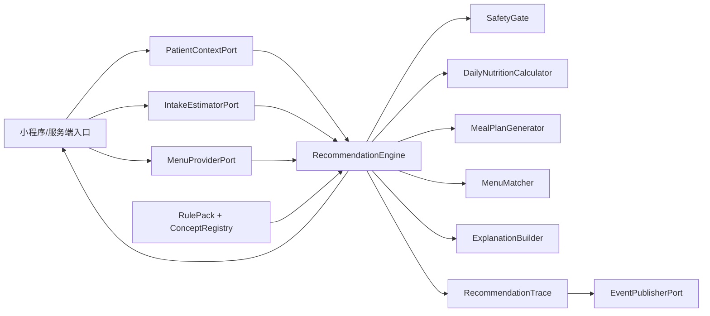
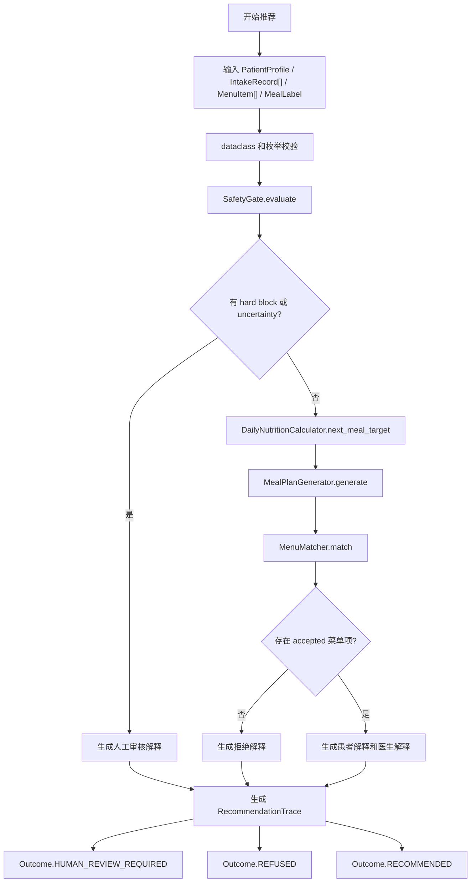
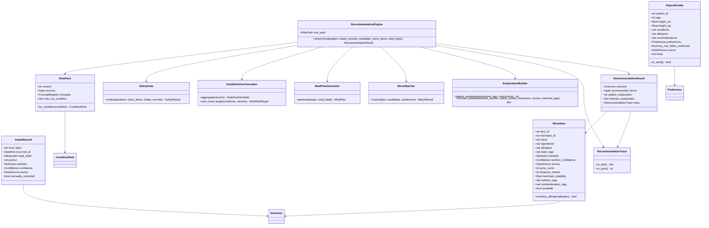
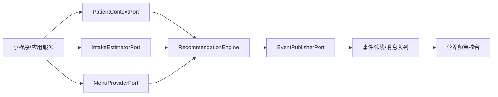

# MediDiet 软件设计文档

版本：0.1.0
目标读者：代码 reviewer、后续重构开发者、接口扩展开发者、测试负责人。

## 1. 设计目标

MediDiet 当前实现的是医院餐食推荐 agent 的核心推荐引擎。它以规则为主，结合患者资料、今日摄入、菜单候选项和偏好，输出下一餐推荐、解释和可审计 trace。

核心设计目标：

- 安全优先：过敏、禁忌、低置信度和越界场景先进入安全门禁。
- 规则优先：慢病营养约束来自版本化规则包，不由自然语言或 LLM 决定。
- 可扩展：图片识别、外卖/食堂平台、HIS/EMR、事件发布通过端口接入。
- 可审计：所有推荐输出都带 trace、枚举 code、规则版本、分数和排除原因。
- 可测试：领域模型、规则、门禁、营养计算、规划、匹配、解释、编排、端口均有单元测试。

## 2. 目录架构

```text
MediDiet/
├── docs/
│   ├── api.md
│   ├── software-design.md
│   ├── testing.md
│   ├── usage.md
│   └── superpowers/
│       ├── plans/
│       └── specs/
├── scripts/
│   └── render_chinese_spec_pdf.py
├── src/
│   └── medidiet/
│       ├── __init__.py
│       ├── cli.py
│       ├── domain.py
│       ├── engine.py
│       ├── explainer.py
│       ├── fixtures.py
│       ├── matcher.py
│       ├── nutrition.py
│       ├── planner.py
│       ├── ports.py
│       ├── rules.py
│       ├── safety.py
│       └── trace.py
├── tests/
│   ├── test_domain.py
│   ├── test_engine.py
│   ├── test_explainer_trace.py
│   ├── test_matcher.py
│   ├── test_nutrition.py
│   ├── test_planner.py
│   ├── test_ports.py
│   ├── test_public_api.py
│   ├── test_rules.py
│   └── test_safety.py
└── pyproject.toml
```

## 3. 模块职责

| 模块 | 职责 | 主要类/函数 |
| --- | --- | --- |
| `domain.py` | 领域模型、枚举、基础校验。 | `PatientProfile`, `IntakeRecord`, `MenuItem`, `ConceptCode`, `MealLabel` |
| `rules.py` | 版本化规则包、概念注册表、营养限制。 | `RulePack`, `ConditionRule`, `NutrientLimit`, `load_baseline_rule_pack` |
| `safety.py` | 安全门禁、阻断/不确定性事件、warning 日志。 | `SafetyGate`, `SafetyEvent`, `SafetyCode` |
| `nutrition.py` | 今日摄入聚合、下一餐剩余营养目标。 | `DailyNutritionCalculator`, `NextMealTarget` |
| `planner.py` | 把营养目标转换为下一餐计划。 | `MealPlanGenerator`, `MealPlan`, `MealInstruction` |
| `matcher.py` | 菜单候选项硬排除和排序。 | `MenuMatcher`, `MatchResult`, `MatchRejectionCode` |
| `explainer.py` | 患者解释和医生/营养师结构化解释。 | `ExplanationBuilder` |
| `trace.py` | 推荐 trace 序列化。 | `RecommendationTrace` |
| `engine.py` | 推荐流程编排。 | `RecommendationEngine`, `RecommendationResult` |
| `ports.py` | 外部系统扩展端口和事件契约。 | `RecommendationRequestEnvelope`, `DomainEvent`, `*Port` |
| `fixtures.py` | deterministic demo 数据。 | `demo_request`, `DEMO_NOW` |
| `cli.py` | 本地 demo CLI。 | `main` |

## 4. 总体架构



设计说明：

- 外部系统只负责准备结构化输入，不直接决定推荐结果。
- `RecommendationEngine` 是应用层编排器，内部组件都可独立测试。
- `RulePack` 是规则和概念的唯一来源。扩展疾病或禁忌时优先改规则包。
- `RecommendationTrace` 是审计出口，面向测试、review、人工审核和后续事件发布。

## 5. 推荐流程图



关键分支：

- 安全门禁触发任何 hard block 或 uncertainty 时，不进入菜单排序，直接人工审核。
- 菜单匹配阶段若所有候选都被排除，返回拒绝推荐。
- 推荐成功时只返回排序最高的菜单项，trace 仍保留所有 accepted 分数和 excluded 原因。

## 6. 核心类图



## 7. 规则与数据设计

### 7.1 概念注册表

`ConceptRegistry` 将疾病、过敏、禁忌、营养标签、口味标签、食材统一成 `ConceptCode`：

```text
ConceptCode(kind=CodeKind.CONDITION, value="hypertension")
ConceptCode(kind=CodeKind.ALLERGEN, value="peanut")
ConceptCode(kind=CodeKind.CONTRAINDICATION, value="high_sodium")
ConceptCode(kind=CodeKind.NUTRITION_TAG, value="low_sodium")
```

设计意图：

- 避免字符串匹配散落在业务逻辑里。
- 通过 `kind` 防止把过敏原、疾病、营养标签混用。
- 后续医院规则扩展可以新增概念定义，而不是改核心流程。

### 7.2 规则包

`RulePack` 是 table-driven 规则入口：

```text
condition -> ConditionRule
ConditionRule -> hard_exclusions + preferred_tags + nutrition_limits
```

MVP baseline：

| 疾病/目标 | hard exclusions | preferred tags | nutrient limits |
| --- | --- | --- | --- |
| 高血压 | `high_sodium` | `low_sodium`, `vegetable_rich` | 单餐钠上限 |
| 糖尿病 | `sugary_drink`, `dessert` | `controlled_carbs`, `high_fiber` | 每日糖上限、4 小时糖上限 |
| 高脂血症 | `deep_fried`, `fatty_meat` | `lean_protein`, `vegetable_rich` | 单餐脂肪上限 |
| 体重控制 | `oversized_portion` | `balanced`, `high_fiber`, `lean_protein` | 单餐能量上限 |

### 7.3 营养限额

`NutrientLimit` 支持三种 scope：

- `PER_MEAL`：直接约束下一餐候选项。
- `DAILY`：统计当天摄入后计算剩余量。
- `ROLLING_WINDOW`：按 `window_hours` 统计最近窗口摄入，例如 4 小时糖摄入上限。

`DailyNutritionCalculator` 负责把规则限制转换成 `RemainingNutrientLimit`。

### 7.4 菜单匹配

`MenuMatcher` 有两层逻辑：

1. 硬排除：
   - `available=False`
   - 命中 `MealPlan.avoid_tags`
   - 单餐候选营养值超过剩余限额
2. 排序：
   - 匹配 required nutrition tag。
   - 匹配患者 taste tag。
   - merchant reliability。
   - 价格和距离是否在偏好范围内。
   - 价格和距离的轻量连续加分。

排序公式当前是确定性启发式，后续可替换，但必须保留排除 code 和 trace。

## 8. 安全设计

`SafetyGate` 在进入营养计算和菜单排序前运行。

### 8.1 hard block

- 非成人。
- 过敏原命中。
- 患者禁忌与疾病规则 hard exclusion 命中。
- 菜单候选项单餐营养值超过疾病规则硬上限。

### 8.2 uncertainty

- 患者关键风险字段未确认。
- 摄入识别低置信度且未人工修正。
- 菜单营养数据低置信度。

### 8.3 日志

- 只有 safety event 以 `WARNING` 写入。
- 默认不写 stderr。
- 显式传 `log_file_path` 时写文件，包含 timestamp、pid、tid、整数 code、规则版本。
- 业务分支使用 `SafetyEvent`，不解析日志。

## 9. 外部扩展设计



扩展原则：

- 外部适配器将外部 JSON/API 数据转换成核心 dataclass。
- 核心引擎不依赖 HTTP、数据库、对象存储、SDK。
- 外部系统错误应在适配层转换成安全拒绝、人工审核或服务层错误。
- 规则包发布、回滚、人工审核完成等动作通过 `DomainEvent` 表达。

## 10. Review 关注点

代码 review 时建议重点检查：

- 是否新增了裸字符串匹配疾病、过敏、禁忌、营养标签。
- 是否绕过 `SafetyGate` 直接推荐。
- 是否新增了非枚举的业务分支 code。
- 是否把日志文本当成业务输入。
- 是否在循环中写入大量低等级日志。
- 是否把患者隐私、原始图片或病历自由文本写入 trace/log。
- 是否对 `datetime` 使用 timezone-aware 类型。
- 是否对负值、过大值、错误枚举类型有测试。
- 是否保持 `RecommendationTrace` 可审计。

## 11. 已知限制

- 当前没有真实 HTTP API server。
- 当前没有真实图片识别、外卖平台、HIS/EMR 适配器。
- baseline 规则阈值是演示级，需要临床审核后才能用于生产。
- 当前 `DOWNGRADED` outcome 预留但未由引擎主动产生。
- 当前只推荐排序最高的一项；多项推荐和替代方案需要后续设计。
- 当前患者解释是规则模板，不调用 LLM。
