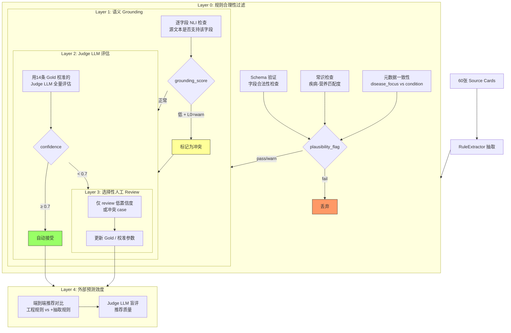
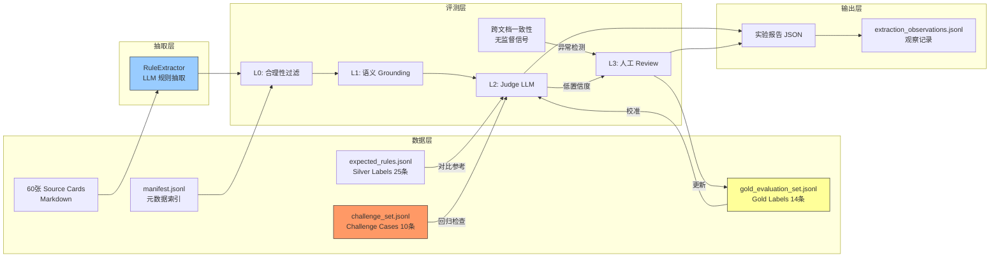
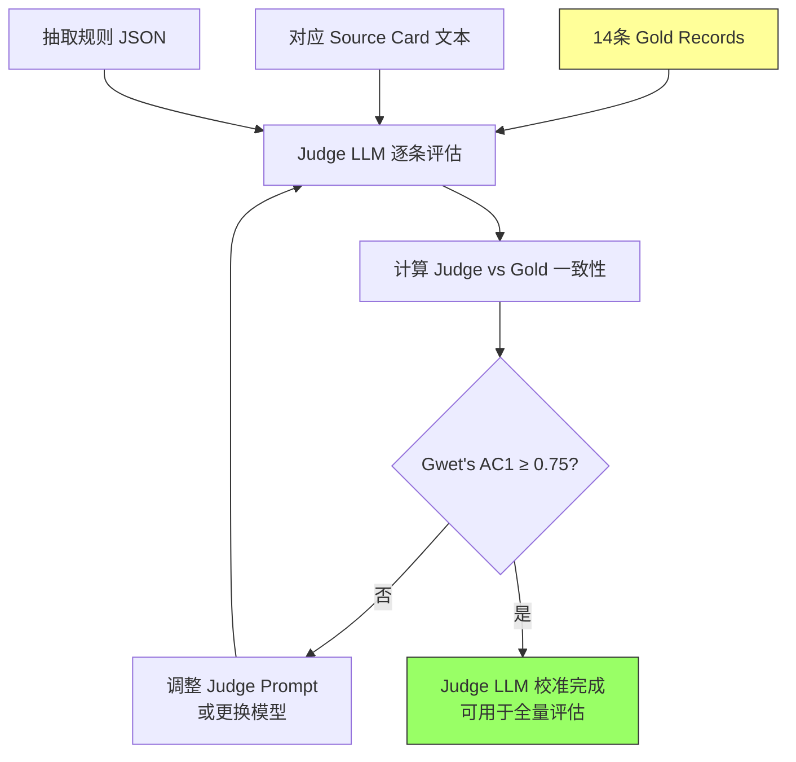
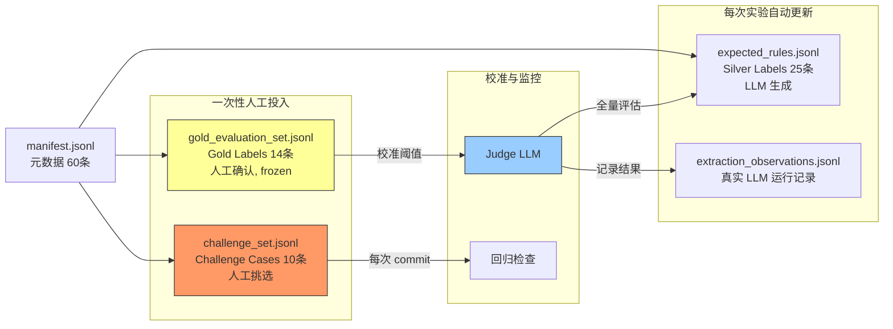
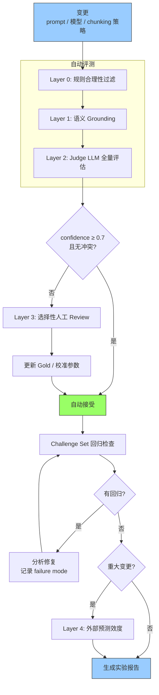
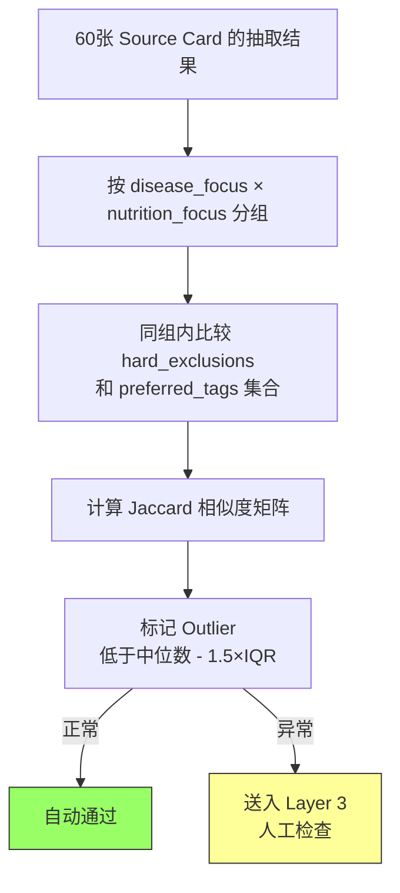

# 营养规则抽取评测体系构建方案

> **目标:** 构建一个不依赖大规模人工标注、可规模化验证的评测体系，驱动"权威资料 → 结构化营养规则"抽取实验迭代。

---

## 1. 背景与动机

### 1.1 当前风险点

营养推荐系统的核心风险在链路前端：

```text
权威指南/论文/患者教育资料 -> LLM/抽取器 -> 结构化 NutrientRule
```

后续的事实匹配与推荐逻辑相对宽松，可通过工程规则和召回策略逐步优化。评测必须优先覆盖这个核心链路，而非仅覆盖 matcher 或检索。

### 1.2 外部 Benchmark 调研结论

| Benchmark | 任务本质 | 不适用原因 |
|-----------|---------|-----------|
| **BREX** (2505.18542) | 商业文档→Condition/Action 对 | 领域不匹配（金融/行政≠营养），规则 schema 太简单 |
| **DesignQA** (2404.07917) | FSAE 规则检索/逐字复制 | "Rule Extraction"实际是信息检索，非结构化抽取 |
| **MedGUIDE** | Path→Matcher→MCQA | 只能验证 matcher，无法验证"原文→规则抽取" |

### 1.3 方法论参考

Mahbub et al. (2026, [arXiv 2604.06028](https://arxiv.org/abs/2604.06028)) 提出六阶段弱监督临床信息抽取验证框架。核心发现：

- Judge LLM 与人类专家一致性 **Gwet's AC1 = 0.80**
- 规则过滤+语义 Grounding 去除 **14.59%** 假阳性
- 外部预测效度 **AUC = 0.80**，优于结构化数据基线

---

## 2. 五层评测体系



### 2.0 整体架构



### 2.1 Layer 0: 规则合理性过滤

**目的:** 在进入正式评估前，用确定性规则过滤明显不合理的抽取结果。

**方法:**

**A. Schema 验证**（已有）: ExtractedConditionRule 字段合法性检查。

**B. 常识检查**：

- **常识从哪来：** 不另造知识库。从项目已有的数据自动推导——`manifest.jsonl` 中 60 张 source card 的 `disease_focus`/`nutrition_focus` 字段 + `NutrientMetric` 枚举 + `ConceptRegistry`。本质上是一张"疾病→相关营养指标"的统计映射表，从已有 metadata 聚合得到，不是外部注入。
- **检查逻辑：** condition 与 nutrition_limits.metric 的组合是否在该映射表中出现过。如 CKD→sodium_mg 出现多次则 pass，CKD→sugar_g 从未出现则 warn。
- **数值范围检查：** nutrition_limit.max_value 是否在合理区间（如钠 500-6000mg/日，超出则 warn）。

**C. 元数据一致性：** source card 的 `disease_focus` 是否与抽取的 condition 一致。

**常识与文本冲突时的处理：**

```
常识说 "unusual" + Layer 1 Grounding 说 "源文本确实支持"
        ↓
  标记为 warn（不是 fail，不丢弃）
        ↓
  送入 Layer 2 Judge LLM 裁决
        ↓
  ┌─ Judge 也支持 → 可能是新知识发现，记入观察日志
  └─ Judge 不支持 → 可能是 LLM 幻觉，进入 Layer 3 人工 review
```

关键设计原则：**Layer 0 只负责"标记可疑"，不负责"判定对错"。** fail 仅用于 schema 不合法、字段缺失等硬错误。常识冲突一律降级为 warn，保留到后续层级裁决。

**产出:** 每条抽取规则的 `plausibility_flag: pass | warn | fail`

### 2.2 Layer 1: 语义 Grounding

**目的:** 验证抽取规则的每个字段是否被源文本支持，自动检测 LLM 幻觉。

**方法:**
- 对每条规则的每个关键字段（condition, hard_exclusions, preferred_tags, nutrition_limits），用 NLI 或小模型检查：
  ```
  前提(源文本chunk) → 假设(字段描述) → {entailment, neutral, contradiction}
  ```
- 优先使用轻量 NLI 模型（如 RoBERTa-large-mnli），按需升级为 LLM judge
- 对 nutrition_limits 的数值做额外校验：源文本中是否有对应数字

**产出:** 每条规则逐字段的 `grounding_score ∈ [0, 1]` 和 `unsupported_fields: [...]`

**成本:** 60 source cards × ~3 rules avg × ~5 fields × ~0.001元/NLI调用 ≈ 几乎为零

### 2.3 Layer 2: Judge LLM 评估

**目的:** 用强 LLM 替代大规模人工标注，对抽取质量做整体判断。

**方法:**

**A. 校准阶段**（一次性）:



用现有 14 条 gold_evaluation_set 校准 Judge LLM：
```
输入: source card文本 + 抽取规则JSON
输出: {verdict: accept|reject|uncertain, confidence: 0-1, reason: "..."}
```
计算 Judge LLM 与 gold 的 Gwet's AC1。目标 AC1 ≥ 0.75。如不达标，调整 prompt 或换模型重试。

**B. 全量评估**（每次实验后）: 校准后的 Judge LLM 评估全部 60 条 source card 的抽取结果。

3. **指标汇报**:
   - Judge 接受率（= 等价于 precision@judge）
   - 字段级通过率（condition/hard_exclusions/preferred_tags/nutrition_limits 各自通过比例）
   - Gwet's AC1（与最近一次 gold 校准对比，检测 Judge 漂移）

**成本:** 校准阶段 ~14 条 × ~0.05元，全量评估 60 条 × ~0.05元 ≈ 几块钱

### 2.4 Layer 3: 选择性人工 Review

**目的:** 只对 Judge LLM 低置信度的 case 投入人力，最大化人工效率。

**触发条件:**
- Judge LLM confidence < 0.7
- Judge LLM verdict 与 silver label (expected_rules.jsonl) 冲突
- Grounding score 低但 Judge 判通过（或反之）

**产出:** 更新 gold_evaluation_set，修正 Judge LLM 校准参数。

**预期规模:** 每轮实验后 review 5-10 条。

### 2.5 Layer 4: 外部预测效度

**目的:** 验证"更好的规则抽取"是否真的带来"更好的推荐"。

**方法:**
- 准备 20 个合成患者 profile（覆盖 hypertension, diabetes, CKD, gout, obesity 等主要疾病）
- 两轮对比实验：
  - Baseline: 仅工程规则
  - Experiment: 工程规则 + 知识抽取规则
- Judge LLM 盲评两组推荐的临床合理性和安全性
- 指标：推荐质量提升率、安全事件减少率

**产出:** 端到端效度报告，作为规则抽取质量的最终背书。

---

## 3. 数据集扩展策略

### 3.0 数据集关系总览



### 3.1 当前基线

| 数据集 | 条数 | 标注方式 | 用途 |
|--------|------|---------|------|
| `manifest.jsonl` | 60 | LLM generated | source card 索引 |
| `expected_rules.jsonl` | 25 | LLM generated (silver) | 规模化评估 |
| `gold_evaluation_set.jsonl` | 14 | 人工确认 (frozen gold) | Judge LLM 校准、最终精度汇报 |
| `challenge_set.jsonl` | 10 | 人工挑选 | 回归监控 |
| `extraction_observations.jsonl` | 待填充 | 真实 LLM 运行 | 观察记录 |

### 3.2 扩展路径

**Phase A（当前 PR）: 补齐评测基础设施**
- 实现 Layer 0 规则过滤
- 实现 Layer 1 语义 Grounding
- 实现 Layer 2 Judge LLM + gold 校准
- 14 条 gold 不做扩展（先验证框架可行性）

**Phase B（验证框架跑通后）: 扩展 Gold**
- 从 14 条扩展到 25-30 条 gold
- 分层抽样覆盖：guideline/paper/manual × 中/英 × should_extract/concept_gap/negative/contextual
- 重新校准 Judge LLM

**Phase C（source card 扩展到 100+ 时）: 亚线性增长**
- 每新增 50-100 条 source card，补充 5-8 条 gold
- Gold 增长与 silver 增长解耦

---

## 4. 实验驱动流程

### 4.1 单次实验标准流程



每次实验自动产出一个结构化报告（见 4.3）。

### 4.2 每次 Commit 的快速检查

```
PYTHONPATH=src:knowledge/src pytest knowledge/tests/test_rule_extraction_dataset.py -v
```
覆盖：manifest 完整性、gold/challenge/expected 格式一致性、chunking 报告。

### 4.3 报告模板

每次实验后生成结构化报告：

```json
{
  "experiment_id": "...",
  "timestamp": "...",
  "change_description": "...",
  "layer_0_plausibility": { "pass": N, "warn": N, "fail": N },
  "layer_1_grounding": { "avg_score": 0.XX, "unsupported_rate": 0.XX },
  "layer_2_judge": { "accept_rate": 0.XX, "gwet_ac1": 0.XX, "field_level": {...} },
  "layer_3_human_review": { "reviewed": N, "accepted": N, "rejected": N },
  "challenge_set": { "regression_count": N, "new_failures": [...] },
  "cross_doc_consistency": { "anomaly_count": N }
}
```

---

## 5. 跨文档一致性（无监督信号）

**原理:** 多张 source card 覆盖同一疾病-营养组合时，规则应一致。不一致即为异常信号。



**方法:**
- 按 `(disease_focus, nutrition_focus)` 分组
- 同组内比较抽取的 hard_exclusions 和 preferred_tags 集合
- 计算 Jaccard 相似度，标记 outlier（低于中位数-1.5×IQR）
- Outlier 不一定是错误，但应进入 Layer 3 人工检查

**示例:**
```
sodium_mg + hypertension 组 (5张 source card):
  en_guideline_who_sodium_2012        → hard_exclusions: [high_sodium] ✓
  en_paper_dash_sodium_trial           → hard_exclusions: [high_sodium] ✓
  en_manual_heart_org_sodium_reduction → hard_exclusions: [high_sodium] ✓
  zh_guideline_hypertension_food_therapy_2023 → hard_exclusions: [high_sodium] ✓
  zh_manual_health_china_salt_reduction → hard_exclusions: [] ← OUTLIER
```

---

## 6. 实施计划

### Step 1: 评测基础设施（本次 PR 范围外，作为下一步）

| 任务 | 预估时间 | 产出 |
|------|---------|------|
| 实现 `RulePlausibilityFilter` | 2h | `knowledge/src/knowledge/rule_plausibility.py` |
| 实现 `SemanticGrounding` | 3h | `knowledge/src/knowledge/semantic_grounding.py` |
| 实现 `JudgeLLMEvaluator` + gold 校准 | 4h | `knowledge/src/knowledge/judge_evaluator.py` |
| 实现 `CrossDocConsistency` | 2h | `knowledge/src/knowledge/cross_doc_consistency.py` |
| 测试覆盖上述模块 | 3h | `knowledge/tests/test_*.py` |

### Step 2: 跑通第一轮实验

1. 校准 Judge LLM（用现有 14 条 gold）
2. 全量评估 60 source cards
3. 产出 baseline 评测报告
4. 选择性 review 低置信度 case

### Step 3: 扩展 Gold Set

1. 分层抽样选定 10-15 条新增 gold
2. 人工标注
3. 重新校准 Judge LLM
4. gold 总量达到 25-30 条

---

## 7. 与现有文件的关系

| 现有文件 | 在新体系中的角色 |
|---------|---------------|
| `manifest.jsonl` | source card 索引，元数据查询 |
| `expected_rules.jsonl` | Silver labels，供 Judge 对比 |
| `gold_evaluation_set.jsonl` | Judge LLM 校准的 gold truth |
| `challenge_set.jsonl` | 回归监控 |
| `extraction_observations.jsonl` | 真实 LLM 运行观察记录 |
| `test_rule_extraction_dataset.py` | 格式+分布验证，每次 commit 运行 |
| `rule_extraction_dataset_smoke.py` | Chunking + 真实 LLM smoke |

新模块（Step 1）:
- `rule_plausibility.py` → Layer 0
- `semantic_grounding.py` → Layer 1
- `judge_evaluator.py` → Layer 2
- `cross_doc_consistency.py` → 无监督信号
- `evaluation_report.py` → 结构化报告生成

---

## 8. 不做什么

- **不再继续寻找外部 benchmark。** 调研已充分说明领域不匹配问题。
- **不急于扩展 gold set 到 50+ 条。** 先用 14 条验证框架可行性。
- **不用 MCQA accuracy 或简单 F1 作为唯一指标。** 多维度汇报（Gwet's AC1 + 字段级通过率 + grounding score + 外部效度）。

---

## 参考资料

- Mahbub et al. (2026). A Multi-Stage Validation Framework for Trustworthy Large-scale Clinical Information Extraction using Large Language Models. [arXiv 2604.06028](https://arxiv.org/abs/2604.06028)
- Yang et al. (2025). Business as Rulesual: A Benchmark and Framework for Business Rule Flow Modeling with LLMs. [arXiv 2505.18542](https://arxiv.org/abs/2505.18542) — 作为对比参照
- Doris et al. (2024). DesignQA: A Multimodal Benchmark for Evaluating LLMs' Understanding of Engineering Documentation. [arXiv 2404.07917](https://arxiv.org/abs/2404.07917) — 作为对比参照
- `docs/research/medguide-dataset-lessons.zh.md` — MedGUIDE 教训
- `knowledge/tests/test_rule_extraction_dataset.py` — 现有数据集验证
