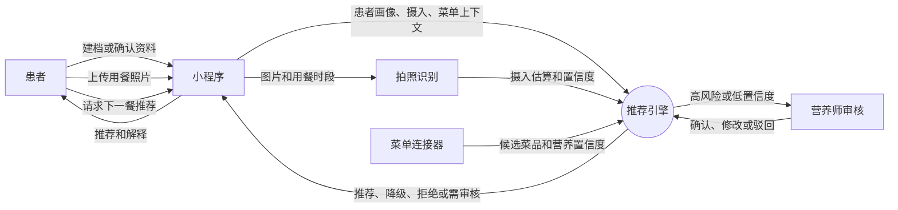
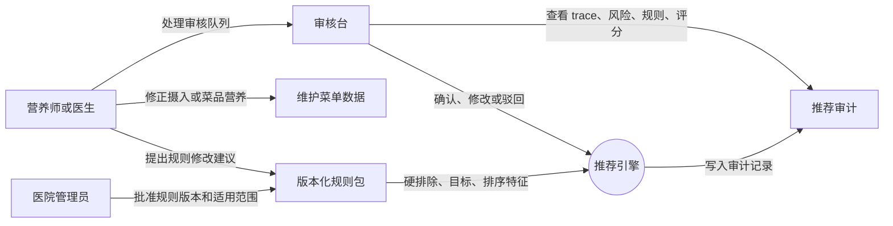
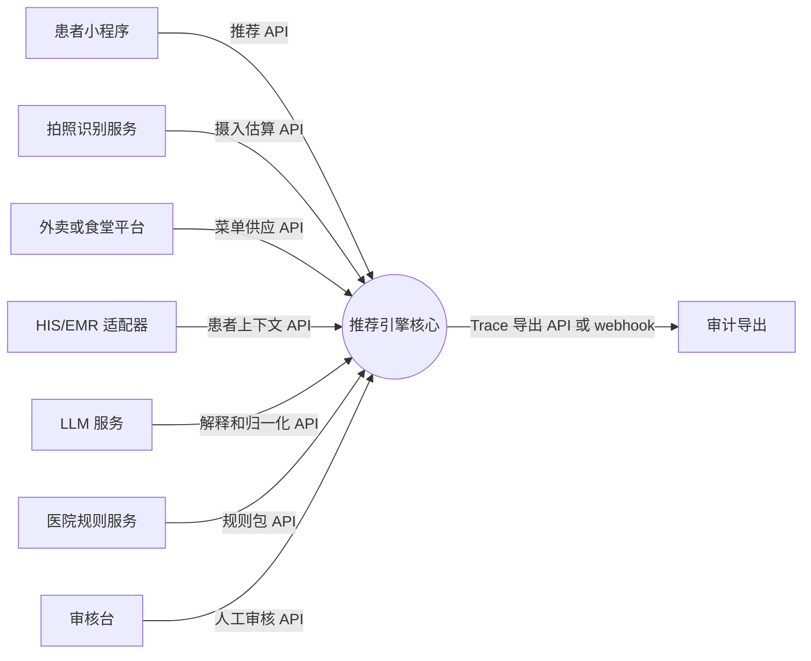

# 医院 Agent 助手餐食推荐引擎设计

日期：2026-05-15

## 1. 目标

MediDiet 第一阶段先建设“医院 Agent 助手”的餐食推荐引擎。引擎用于在患者下一餐之前，结合营养学规则、慢病约束、过敏和禁忌、患者显式口味偏好、当天已摄入食物，以及来自外卖平台或医院食堂的候选菜单，给出安全、可解释、可审计的餐食推荐。

第一版聚焦推荐引擎，不直接实现完整小程序、拍照识别模型、外卖下单闭环或 HIS/EMR 集成。这些能力在设计中作为上游或下游接口保留。

## 2. MVP 范围

### 2.1 第一版包含

- 成人慢病门诊或居家患者。
- 第一版慢病规则基线覆盖：
  - 高血压。
  - 糖尿病。
  - 高血脂。
  - 肥胖或控重目标。
- 过敏和明确禁忌的硬排除。
- 推荐“下一餐”，同时参考当天已经摄入的食物。
- 两层推荐输出：
  - 先生成营养合规的餐食方案。
  - 再从外卖、医院食堂或维护菜单中匹配具体菜品。
- 普通风险场景下，患者可直接看到推荐。
- 高风险或低置信度场景下，进入营养师或医生确认。
- 双层解释：
  - 患者端展示简洁、可理解的推荐理由。
  - 营养师端展示规则命中、数据来源、置信度、评分和风险等级。

### 2.2 第一版不包含

- 儿童、孕产、肾病、痛风、肿瘤、术后、吞咽困难、营养不良等复杂临床营养场景。
- 药物调整建议或医学诊断。
- 完整 HIS/EMR 集成。
- 真实外卖下单和支付闭环。
- 从照片严格还原临床级营养核算。
- 跨周或跨月的长期饮食计划。

默认适用人群之外的患者，不应自动推荐，应拒绝推荐或进入人工确认。未来可由医院配置适用人群范围。

## 3. 产品安全边界

本系统不是“自动营养师”，而是带安全门禁的推荐系统。

普通风险场景可以自动推荐。高风险或不确定场景必须转人工确认。高风险触发条件包括：

- 命中过敏或明确禁忌。
- 与慢病规则存在严重冲突。
- 患者画像缺少关键风险信息。
- 患者自填的关键风险项尚未确认。
- 拍照识别或摄入估算置信度过低。
- 菜品营养数据缺失、冲突或置信度过低。
- 候选菜单中没有任何满足硬约束的餐食。
- 患者属于第一版不覆盖的复杂临床人群。

推荐引擎需要支持四种结果：

- 自动推荐。
- 低风险降级推荐，并清楚说明不足。
- 拒绝推荐，并给出原因和下一步建议。
- 转人工确认。

## 4. 临床规则治理

本设计不直接定义最终临床营养阈值。实施时必须将经过审阅、版本化的临床和膳食参考资料转换成机器可读规则，并由合格医生或营养师审核后，才能用于患者端推荐。

第一版规则包的候选参考来源包括：

- 中国营养学会《中国居民膳食指南 2022》。
- 国家卫生健康委《成人高血压食养指南 2023》。
- 国家卫生健康委《成人糖尿病食养指南 2023》。
- 国家卫生健康委《成人高脂血症食养指南 2023》。
- 国家卫生健康委《成人肥胖食养指南 2024》。
- 中华医学会糖尿病学分会《中国糖尿病防治指南 2024》，用于临床背景和排除条件。
- 中国高血压防治指南修订委员会等《中国高血压防治指南 2024》，用于临床背景和排除条件。
- 中国血脂管理指南修订联合专家委员会《中国血脂管理指南 2023》，用于临床背景和排除条件。

产品规则包应记录：

- 来源标题、URL 或正式发表引用。
- 来源版本和发布日期。
- 规则作者和审核人。
- 生效日期。
- 适用人群。
- 禁忌严重程度。
- 规则类型：硬排除、软目标或排序特征。
- 变更历史。

未来医院自定义规则只能通过该版本化规则系统覆盖内置基线。

## 5. 总体架构

采用“规则核心 + LLM 辅助”的架构。

### 5.1 输入

患者画像：

- 计算营养目标所需的人口学信息。
- 身高、体重、BMI 或控重目标。
- 慢病标签。
- 过敏和明确禁忌。
- 显式口味偏好和忌口。
- 价格、距离和便利性偏好。
- 数据来源、确认状态和更新时间。

当天摄入：

- 食物名称。
- 估算份量。
- 估算能量、碳水、蛋白质、脂肪、钠、糖和膳食纤维。
- 识别来源和置信度。

候选菜单：

- 菜名、分类、食材和口味标签。
- 营养标签或营养估算。
- 价格、距离、可售状态和商家可靠性。
- 营养数据来源和置信度。

规则基线：

- 疾病营养约束和目标。
- 适用人群。
- 证据来源。
- 规则版本。
- 未来医院覆盖层。

### 5.2 核心组件

安全门禁：

- 检查适用人群、过敏、禁忌、疾病硬约束、患者资料完整性、摄入置信度和菜单数据置信度。

当日营养状态计算器：

- 估算患者今天已经摄入的营养。
- 计算下一餐剩余或推荐目标。

餐食方案生成器：

- 先生成营养合规的下一餐模式，再绑定具体菜品。
- 示例：低钠蛋白菜、控制主食份量、搭配绿叶菜、不配含糖饮料。

菜单匹配器：

- 硬排除不安全或不兼容菜品。
- 对剩余菜品按营养匹配、安全余量、口味偏好、价格距离和商家/数据可靠性打分。

解释生成器：

- 使用 LLM 将规则命中和营养事实转换为患者端与营养师端解释。
- 不允许生成规则或数据没有支持的医学主张。

推荐审计器：

- 记录每次推荐的规则命中、过滤原因、评分、置信度、LLM 输出摘要、风险等级和人工审核状态。

### 5.3 LLM 边界

LLM 可以用于：

- 辅助食物照片识别后的名称归一和补全。
- 在结构化菜单数据不完整时辅助理解菜品。
- 在安全营养教育边界内回答患者问题。
- 生成患者端和营养师端解释。

LLM 不允许：

- 覆盖硬性安全规则。
- 编造临床证据。
- 提供诊断或药物调整建议。
- 推荐未通过安全校验的餐食。
- 未经最终规则层安全校验就输出给患者。

## 6. 用例图

以下用例图用于说明推荐引擎与患者、小程序、拍照识别、菜单连接器、营养师审核台、医院规则和未来医院系统之间的关系。

### 6.1 患者下一餐推荐用例



### 6.2 营养师审核与规则治理用例



### 6.3 后续扩展接口用例



## 7. 数据模型

### 7.1 PatientProfile 患者画像

表示推荐引擎使用的患者上下文。

关键字段：

- 年龄段、性别等营养目标所需信息。
- 身高、体重、BMI、控重目标。
- 慢病：高血压、糖尿病、高血脂、肥胖或控重。
- 过敏原和硬禁忌。
- 显式忌口和口味偏好。
- 价格、距离和便利性偏好。
- 数据来源：患者自填、医生/营养师录入，或未来 HIS/EMR 导入。
- 关键风险字段确认状态。
- 更新时间。

第一版支持患者自填，但关键风险项需要确认提示。未来支持医生录入和 HIS/EMR 导入。

### 7.2 ConditionRule 疾病规则

表示指南基线规则和未来医院覆盖规则。

关键字段：

- 疾病类型。
- 适用人群。
- 硬排除条件。
- 软性营养目标。
- 营养阈值或推荐范围。
- 证据来源。
- 规则严重程度。
- 规则版本。
- 医院覆盖来源。

第一版使用内置指南基线。数据模型必须支持后续医院自定义规则覆盖，但 MVP 不要求实现医院规则后台。

### 7.3 IntakeRecord 今日摄入记录

表示患者当天已经吃过的食物。

关键字段：

- 用餐时间。
- 食物名称。
- 估算份量。
- 能量、碳水、蛋白质、脂肪、钠、糖和膳食纤维估算。
- 识别来源。
- 置信度。
- 人工修正状态。

MVP 使用“营养估算 + 置信度”。低置信度记录会触发人工确认或保守推荐。后续版本再向临床级营养核算靠近。

### 7.4 MenuItem 候选菜品

表示一个候选菜品、套餐或组合餐。

关键字段：

- 菜品 ID 和商家 ID。
- 名称、分类、食材和口味标签。
- 营养数据：
  - 能量。
  - 碳水。
  - 蛋白质。
  - 脂肪。
  - 钠。
  - 糖。
  - 膳食纤维，如可获得。
- 营养来源：
  - 平台或商家营养标签。
  - 根据菜名、图片和食材库的系统估算。
  - 人工维护营养数据。
- 数据置信度。
- 价格、距离、可售状态。
- 商家可靠性。

营养数据优先级：

1. 平台或商家提供的营养标签。
2. 人工维护的营养数据。
3. 系统估算。

低置信度或缺失营养数据会降低排序可信度，或触发人工确认。

### 7.5 RecommendationTrace 推荐审计

表示一次推荐请求的审计记录。

关键字段：

- 请求上下文摘要。
- 患者画像版本。
- 使用的摄入记录。
- 候选菜单集合。
- 规则版本。
- 规则命中和排除原因。
- 当日营养状态和下一餐目标。
- 候选菜品评分。
- LLM 输入/输出摘要。
- 风险等级。
- 结果：推荐、降级推荐、拒绝或人工审核。
- 人工审核状态和审核修改。

每一次推荐都应该能通过 RecommendationTrace 复盘。

## 8. 推荐流程

1. 接收推荐请求：
   - 患者画像。
   - 当天摄入。
   - 候选菜单。
   - 用餐时段。
2. 执行安全和资格门禁：
   - 检查适用人群。
   - 检查过敏和禁忌。
   - 检查慢病硬约束。
   - 检查关键患者资料是否完整和已确认。
   - 检查摄入和菜单数据置信度。
3. 估算当天营养状态：
   - 汇总当天已摄入能量、碳水、蛋白质、脂肪、钠、糖和膳食纤维。
   - 保留置信度和不确定性。
4. 计算下一餐目标：
   - 根据慢病规则和当天摄入情况调整。
   - 示例：如果当天钠摄入偏高，晚餐应更偏低钠。
5. 生成餐食方案：
   - 先生成营养合规的餐食模式，而不是直接选菜。
6. 匹配具体菜品：
   - 排除不安全菜品。
   - 对合规候选进行评分。
   - 构建一个或多个推荐组合。
7. 应用结果策略：
   - 安全且数据可靠时自动推荐。
   - 不完美但低风险时降级推荐。
   - 无法满足硬约束时拒绝推荐。
   - 高风险或不确定时转人工确认。
8. 生成解释：
   - 患者友好解释。
   - 营养师审核解释。
9. 最终安全校验：
   - 对推荐和解释再次做规则校验。
10. 写入 RecommendationTrace。

## 9. 排序策略

安全是硬门槛。过敏、禁忌和严重疾病冲突不是排序因子，而是直接排除条件。

对剩余候选使用可配置加权排序。MVP 默认权重建议：

- 营养匹配：45%。
- 安全余量：20%。
- 口味偏好：15%。
- 价格和距离：10%。
- 商家和营养数据可靠性：10%。

后续可以允许医院或产品运营调整权重。

## 10. 人工审核

以下情况需要人工审核：

- 检测到硬性安全冲突。
- 信息不完整或置信度低。
- 患者人群超出 MVP 范围。
- 菜品营养数据不足以做安全自动判断。
- 没有候选餐食满足硬约束。

营养师或医生可执行的动作：

- 确认推荐。
- 修改餐食方案。
- 选择替代菜品。
- 增加或调整禁忌。
- 修正患者画像。
- 修正摄入记录。
- 标注菜品营养数据。
- 驳回推荐并给出下一步建议。

人工审核结果不应直接自动更新线上规则。它们应先作为质控样本、规则候选、菜单可靠性修正或偏好信号沉淀。

## 11. 解释设计

### 11.1 患者端解释

患者端解释应该简短、具体、不过度制造焦虑。

它需要回答：

- 为什么这餐适合我？
- 今天还需要注意什么？
- 哪些常见替代餐不推荐，原因是什么？
- 这条推荐是自动推荐、保守推荐，还是等待人工确认？

示例：

> 这份餐钠含量较低，主食份量适中，也能提供足够蛋白质。由于你午餐估算钠摄入偏高，晚餐建议不要喝汤底，也不要额外加酱料。

### 11.2 营养师端解释

营养师端解释应该包括：

- 风险等级。
- 命中的规则。
- 数据来源和置信度。
- 营养估算。
- 当天摄入摘要。
- 候选菜品过滤原因。
- 评分明细。
- LLM 输出摘要。
- 审计 trace ID 或链接。

## 12. 错误处理和降级

推荐引擎应该安全降级：

- 如果菜品违反硬规则，直接排除。
- 如果没有菜品满足硬规则，拒绝推荐并解释原因。
- 如果只有不完美但低风险的选择，展示最佳低风险候选并说明不足。
- 如果患者或菜单数据不可靠，转人工确认。
- 如果 LLM 输出未通过安全校验，重新生成或退回规则解释。
- 如果外部菜单 API 失败，返回结构化不可用状态，不编造菜单。

## 13. API 和可扩展性边界

推荐引擎应提供清晰 API 边界，使小程序、拍照识别模块、外卖平台连接器和营养师审核台可以独立演进。

推荐请求示例：

```json
{
  "patientProfile": {},
  "todayIntake": [],
  "candidateMenuItems": [],
  "mealTime": "dinner",
  "ruleVersion": "baseline-2026-05-15"
}
```

推荐响应示例：

```json
{
  "outcome": "recommended | downgraded | refused | human_review_required",
  "mealPlan": {},
  "recommendedItems": [],
  "patientExplanation": "",
  "clinicianExplanation": {},
  "riskLevel": "low | medium | high",
  "traceId": ""
}
```

### 13.1 可扩展性原则

- 推荐引擎保持为稳定核心。小程序、识别服务、外卖平台、医院系统、LLM 服务和规则管理工具都通过适配器接入。
- 每个外部输入都必须携带来源、版本、时间戳、置信度或确认状态。没有来源的数据视为不确定，而不是事实。
- 所有适配器都应可替换。医院后续可以替换外卖平台连接器、拍照识别模型、LLM 供应商或医院规则服务，而不改动核心推荐逻辑。
- 外部服务不能绕过安全门禁。它们的输出只能作为证据进入推荐引擎，不能直接变成最终推荐。
- 所有接口都应版本化。破坏性变更需要新的 API 版本或兼容适配层。
- 所有患者可见输出都必须能追溯到 RecommendationTrace。

### 13.2 扩展接口

患者端客户端 API：

- 面向未来小程序。
- 提交患者资料更新、偏好更新、用餐照片记录和推荐请求。
- 接收推荐结果、患者解释、替代选择和等待审核状态。

摄入估算 API：

- 面向拍照识别或手动记录模块。
- 返回食物名称、份量估算、营养估算、置信度和不确定字段。
- 支持未来替换为更好的识别模型或人工修正流程。

菜单供应 API：

- 面向外卖平台、医院食堂或维护菜单数据库。
- 返回候选菜品、食材、口味标签、营养标签或估算、价格、距离、可售状态、商家可靠性和营养数据来源。
- 将不同平台菜单归一为内部 MenuItem 结构。

规则包 API：

- 面向内置指南基线和未来医院自定义规则。
- 提供版本化硬排除、软目标、排序特征、适用人群、证据来源和审核人信息。
- 支持灰度发布、回滚和医院级覆盖。

人工审核 API：

- 面向营养师审核台。
- 暴露审核队列、推荐 trace、风险原因、可编辑推荐和最终审核决策。
- 将审核动作写回审计日志。

患者上下文 API：

- 预留给未来 HIS/EMR 集成。
- 在法律和运营条件满足时，导入诊断、过敏、医生录入饮食医嘱、化验相关排除条件或护理计划约束。
- 必须区分医生录入数据和患者自填数据。

LLM 服务 API：

- 用于解释生成、食物名称归一和安全患者问答。
- LLM 只能接收结构化规则命中和营养事实，不能拥有不受限制的推荐决策权。
- LLM 输出必须通过最终规则层校验。

审计导出 API：

- 面向质控看板、医院合规和未来研究评估。
- 导出匿名化或授权后的 trace、审核动作、模型版本、规则版本和推荐结果。

### 13.3 版本兼容

每个 API 请求应包含 `schemaVersion`、`sourceSystem`、`sourceVersion`、`requestId` 和时间戳。推荐引擎应通过适配器兼容旧版本，并对不支持的版本返回明确错误。规则包和推荐 trace 必须保存决策当时使用的精确版本。

### 13.4 扩展事件流

推荐引擎应发出领域事件，供后续功能订阅：

- `RecommendationRequested`。
- `RecommendationCompleted`。
- `HumanReviewRequired`。
- `HumanReviewCompleted`。
- `PatientPreferenceUpdated`。
- `IntakeRecordCorrected`。
- `MenuNutritionAnnotated`。
- `RulePackPublished`。
- `RulePackRolledBack`。

这些事件可以让通知、分析、偏好学习、质控看板和临床审核流程在后续阶段接入，而不耦合到核心推荐事务。

## 14. 测试策略

MVP 验证应覆盖以下方面。

安全测试：

- 过敏硬排除。
- 疾病硬约束。
- 适用人群之外的转人工或拒绝。
- 无合规餐食时拒绝推荐。

营养测试：

- 当天摄入会影响下一餐推荐。
- 钠、糖、碳水、脂肪和能量目标按预期生效。
- 低风险降级推荐会被清楚标注。

数据质量测试：

- 低置信度照片估算触发审核。
- 缺失菜单营养数据触发审核或降低置信度。
- 患者关键风险字段要求确认。

解释测试：

- 患者解释能理解且不过度承诺。
- 营养师解释包含规则、来源、置信度和评分。
- RecommendationTrace 可以复盘决策。

LLM 安全测试：

- LLM 不能覆盖规则。
- LLM 不能编造证据。
- LLM 不能提供诊断或药物建议。
- 患者端输出必须通过最终安全校验。

排序测试：

- 硬约束始终优先于口味偏好。
- 权重配置只影响安全候选之间的排序。

## 15. 路线图

### Phase 1：推荐引擎核心

- 推荐 API。
- 成人慢病和过敏规则基线。
- 患者画像、摄入、菜单和审计模型。
- 模拟摄入和菜单数据。
- 规则过滤、评分、解释和审计 trace。

### Phase 2：数据接入

- 食物拍照识别接口。
- 外卖或食堂菜单连接器接口。
- 带置信度的营养估算。
- 人工审核触发闭环。

### Phase 3：产品体验

- 小程序患者端体验。
- 营养师审核台。
- 显式偏好收集。
- 从选择、跳过、复购和评分中学习偏好。
- 医院自定义规则配置。

### Phase 4：医院集成与效果评估

- HIS/EMR 集成。
- 长期饮食计划。
- 质控看板。
- 真实世界安全性、依从性和满意度评估。

## 16. 成功标准

MVP 成功的标准不是“推荐得像人一样聪明”，而是：

- 不推荐过敏或禁忌餐食。
- 能根据当天已摄入内容调整下一餐。
- 能向患者清楚解释推荐理由。
- 能给营养师完整证据链。
- 在信息不安全或不确定时会停止或升级。
- 每一次推荐都有可复盘的审计记录。

## 17. 设计阶段参考链接

- 中国营养学会《中国居民膳食指南 2022》发布页：https://dg.cnsoc.org/article/04/glVJd6DRRCqm-hYzWlEVNQ.html
- 中国营养学会《中国居民膳食指南 2022》核心准则：https://dg.cnsoc.org/article/04/J4-AsD_DR3OLQMnHG0-jZA.html
- 国家卫生健康委成人慢病食养指南通知：https://www.nhc.gov.cn/sps/c100088/202301/f01895a06c5349ef999f25da833c166d.shtml
- 国家卫生健康委《成人高血压食养指南 2023》PDF：https://www.nhc.gov.cn/sps/c100088/202301/f01895a06c5349ef999f25da833c166d/files/1732844468193_68545.pdf
- 国家卫生健康委《成人糖尿病食养指南 2023》PDF：https://www.nhc.gov.cn/sps/c100088/202301/f01895a06c5349ef999f25da833c166d/files/1732844468278_20318.pdf
- 国家卫生健康委《成人高脂血症食养指南 2023》PDF：https://www.nhc.gov.cn/cms-search/downFiles/cd496bd490bc4564beeb009c1612eb11.pdf
- 国家卫生健康委《成人肥胖食养指南 2024》编制说明 PDF：https://www.nhc.gov.cn/sps/c100088/202312/3fbdf286857a4235be5749ca7a7b2ac9/files/1732845040999_78396.pdf
- 中华医学会糖尿病学分会指南页：https://diab.cma.org.cn/cn/zhinangongshi.aspx
- 《中国血脂管理指南 2023》：https://rs.yiigle.com/CN2021/1449955.htm
- 《中国高血压防治指南 2024》文章页：https://cjournal.hep.com.cn/1673-7245/CN/1160171857581368285
