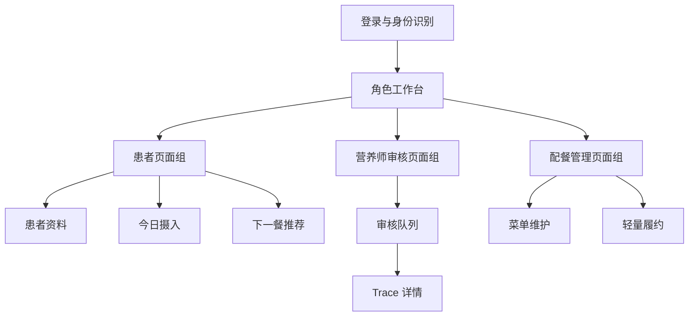
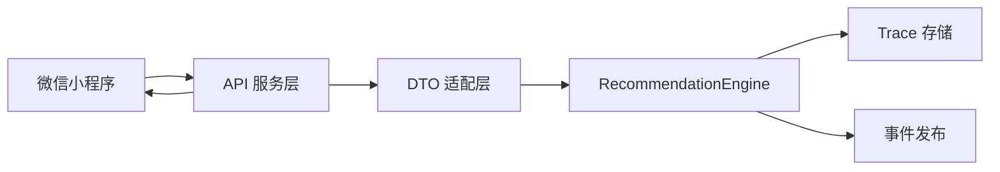
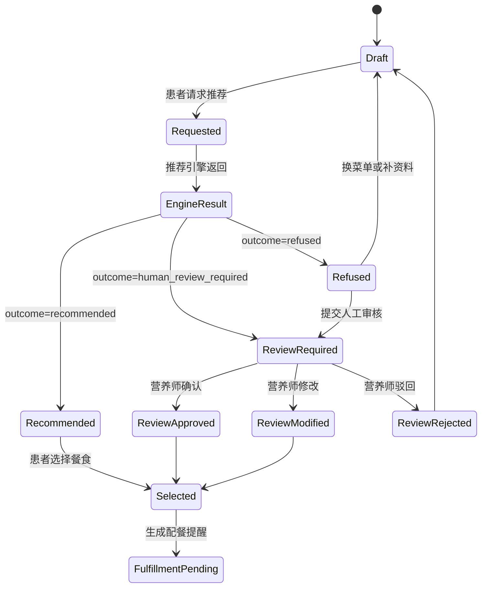

# MediDiet 推荐引擎微信小程序前端设计

日期：2026-05-17

## 1. 背景

MediDiet 已经完成推荐引擎核心设计，并在 `recommendation-engine-core` worktree 中实现了 Python 核心包。核心引擎通过 `RecommendationEngine.recommend(...)` 接收 `PatientProfile`、`IntakeRecord[]`、`MenuItem[]` 和 `MealLabel`，返回 `RecommendationResult` 与可审计的 `RecommendationTrace`。

本设计面向下一阶段前端体验：在同一个微信小程序中服务三类用户：

- 患者。
- 营养师或医疗审核人员。
- 配餐管理人员。

前端不是独立“饮食建议工具”，而是推荐引擎的业务闭环界面。它需要让患者安全地发起下一餐推荐，让营养师处理高风险或低置信度推荐，让配餐管理人员维护可被推荐引擎使用的可信菜单数据。

## 2. 目标

第一版小程序前端原型目标：

- 设计同一小程序内的三角色体验和权限入口。
- 形成主要页面 wireframe 与交互流程。
- 明确页面数据如何对接现有推荐引擎模型和 trace。
- 支持患者端“拍照优先 + 手动补录/修正”的今日摄入记录。
- 支持营养师以推荐审核队列为主处理 `human_review_required`。
- 支持配餐管理以 `MenuItem` 数据维护为主，轻量覆盖已确认餐食履约状态。

本阶段交付的是高保真一点的交互原型设计和接口对接说明，不直接实现微信小程序代码。

## 3. 范围

### 3.1 MVP 包含

- 同一微信小程序内的角色工作台首页。
- 多角色账号的身份切换。
- 患者端：
  - 健康资料确认。
  - 今日摄入记录。
  - 拍照上传后的估算结果确认。
  - 手动补录和修正。
  - 下一餐推荐请求。
  - 推荐成功、拒绝推荐、等待人工审核三类结果状态。
- 营养师端：
  - 待审核推荐队列。
  - 推荐 trace 详情。
  - 风险、规则、候选排除和评分查看。
  - 确认、修改、驳回三类审核动作。
  - 从审核动作中沉淀数据质控标记。
- 配餐管理端：
  - 菜单列表。
  - 菜品详情和营养标注。
  - 过敏原、禁忌标签、营养标签、置信度和可售状态维护。
  - 已确认餐食的轻量履约状态。
- 前端与推荐服务的 DTO 映射、状态机和错误处理设计。

### 3.2 MVP 不包含

- 真实微信小程序代码实现。
- 真实 HTTP 服务实现。
- 完整订单、支付、配送闭环。
- 复杂批量菜单编辑。
- 医院规则包后台。
- HIS/EMR 生产集成。
- 药物建议、诊断建议或长期临床营养计划。
- 大屏质控看板或统计分析。

## 4. 已确认设计决策

### 4.1 三角色同一小程序

患者、营养师和配餐管理人员都在同一个微信小程序中使用系统。登录后根据权限展示角色工作台。拥有多个角色的账号可以切换当前身份。

### 4.2 首页采用角色工作台

小程序首页不是固定底部 Tab 承载所有角色，而是“角色工作台”。工作台按当前身份展示最重要的今日任务：

- 患者：下一餐推荐和今日摄入。
- 营养师：待审核推荐。
- 配餐管理：菜单数据缺口和已确认餐食。

### 4.3 前端架构采用“角色工作台 + 共享推荐状态机”

三类角色拥有各自页面组，但围绕同一条推荐生命周期流转：

1. 患者提交资料、摄入和下一餐推荐请求。
2. 服务层转换为核心引擎模型并调用推荐引擎。
3. 推荐引擎返回 `recommended`、`refused` 或 `human_review_required`。
4. 普通推荐直接展示给患者。
5. 高风险或不确定推荐进入营养师审核队列。
6. 审核完成后回写患者结果，并可生成配餐履约状态。
7. 配餐端维护菜单数据，反哺后续推荐质量。

### 4.4 患者摄入记录采用双入口

患者端使用“拍照优先 + 手动补录/修正”。拍照上传后产生估算结果，患者需要确认或修正。所有摄入记录最终映射为带置信度的 `IntakeRecord`。低置信度且未人工修正的摄入可触发人工审核。

### 4.5 审核台以推荐审核队列为主

营养师 MVP 不做独立复杂质控系统，而是围绕 `RecommendationTrace` 处理 `human_review_required`。摄入估算错误、菜单营养缺失、过敏原漏标等质控问题从审核动作中沉淀。

### 4.6 配餐端以菜单数据维护为主

配餐管理 MVP 的第一职责是维护可信 `MenuItem[]`。履约只做轻量状态，不替代医院或食堂已有订单系统。

## 5. 总体信息架构



## 6. 全局导航与权限

### 6.1 角色工作台

登录后进入角色工作台。工作台顶部显示：

- 当前角色。
- 切换角色入口。
- 重要消息或待办提示。

工作台卡片按角色动态生成：

- 患者：
  - “获取下一餐推荐”。
  - “记录刚吃过的食物”。
  - 今日摄入摘要。
  - 健康资料确认状态。
- 营养师：
  - 待审核数量。
  - 高风险数量。
  - 低置信度数量。
  - 即将超时数量。
- 配餐管理：
  - 今日可推荐菜品数。
  - 缺营养值菜品数。
  - 过敏原待补菜品数。
  - 已确认待准备餐食数。

### 6.2 角色切换

多角色用户可以通过工作台顶部切换身份。切换后进入对应工作台，不共享不相关的页面入口。

权限原则：

- 患者只能查看自己的健康资料、摄入记录、推荐结果和审核状态。
- 营养师只能查看被授权患者的审核队列和 trace。
- 配餐管理人员只能查看菜单维护、菜品标注和已确认餐食的履约状态。
- 患者端不暴露完整评分、规则包细节和审核内部字段。

## 7. 患者端设计

### 7.1 患者工作台

患者工作台主视觉是“下一餐推荐”。页面重点：

- 当前餐次提示，如“晚餐前”。
- 今日摄入摘要。
- 风险资料状态。
- 主按钮：获取下一餐推荐。
- 次按钮：记录刚吃过的食物。

患者看到的是行动建议，不是后台数据。示例信息：

- “今晚建议清淡控主食。”
- “午餐钠摄入偏高，晚餐推荐会优先低钠、控糖和足量蛋白。”
- “关键风险字段已确认。”

### 7.2 健康资料确认

患者资料页映射 `PatientProfile`。

主要字段：

- 年龄。
- 身高。
- 体重。
- 慢病或健康目标。
- 过敏原。
- 明确禁忌。
- 不喜欢的食材。
- 口味偏好。
- 价格和距离偏好。
- 资料来源。
- 关键风险字段确认状态。

关键风险字段未确认时，患者端可以继续补资料，但不能把自动推荐作为正式建议展示。

### 7.3 今日摄入记录

今日摄入页支持两种入口：

- 拍照识别。
- 手动补录。

拍照识别流程：

1. 患者选择餐次。
2. 上传或拍摄照片。
3. 前端调用摄入估算 API。
4. 页面展示食物名称、份量、营养估算和置信度。
5. 患者确认或手动修正。
6. 服务层写入 `IntakeRecord`。

展示字段：

- 食物名称。
- 餐次。
- 份量。
- 能量。
- 碳水。
- 蛋白质。
- 脂肪。
- 钠。
- 糖。
- 膳食纤维。
- 置信度。
- 是否人工修正。

低置信度设计：

- 置信度低于服务端阈值时，页面提示“估算不确定，请确认或补充”。
- 患者可以手动修正。
- 如果仍不可靠，推荐结果进入人工审核。

### 7.4 下一餐推荐请求

患者点击“获取下一餐推荐”时，前端提交：

- 请求信封：`schemaVersion`、`sourceSystem`、`sourceVersion`、`requestId`、`createdAt`。
- 当前患者资料。
- 今日摄入记录。
- 下一餐餐次 `MealLabel`。

服务层负责获取候选 `MenuItem[]`，并调用 `RecommendationEngine.recommend(...)`。

### 7.5 推荐结果页

推荐结果页根据 `outcome` 分为三种状态。

#### recommended

展示：

- 推荐餐卡片。
- 菜名、价格、供应点、距离。
- 低钠、控主食、蔬菜丰富、优质蛋白等标签。
- 患者友好解释 `patientExplanation`。
- 注意事项，如少放酱汁、控制甜饮。
- `traceId` 的简短追溯标识。

操作：

- 选择这餐。
- 换一份。
- 查看原因。

#### refused

展示：

- “当前候选餐食不满足安全和营养要求，暂不建议自动推荐。”
- 简洁原因，如“没有满足过敏和禁忌要求的候选餐食”。
- 下一步建议，如重新选择供应点、补充资料或等待人工确认。

操作：

- 更换菜单来源。
- 补充健康资料。
- 提交人工审核。

#### human_review_required

展示：

- “当前信息需要营养师确认后再推荐餐食。”
- 触发原因的患者友好版本，如“照片估算不确定”或“资料需要确认”。
- 审核状态。
- 可补充资料入口。

操作：

- 补充资料。
- 查看审核进度。
- 撤回请求。

### 7.6 患者端不展示的信息

患者端不展示：

- 完整规则命中列表。
- 评分权重。
- 内部 code。
- LLM 边界说明。
- 复杂临床阈值。
- 营养师审核内部备注。

## 8. 营养师审核台设计

### 8.1 审核工作台

营养师工作台显示：

- 待审核总数。
- 高风险数量。
- 低置信度数量。
- 即将超时数量。
- 最近待办列表。

队列优先级建议：

1. 高风险安全事件。
2. 等待时间长的请求。
3. 低置信度摄入。
4. 关键资料未确认。
5. 无合规候选菜品。

### 8.2 审核队列

队列项展示：

- 患者匿名或授权显示标识。
- 餐次。
- 请求时间。
- 风险等级。
- 触发原因。
- 当前状态。

筛选维度：

- 风险等级：high、medium、low。
- 触发原因：低置信度、过敏、禁忌、资料缺失、营养阈值冲突、无合规菜品。
- 餐次：早餐、午餐、晚餐、加餐。
- 状态：待处理、已确认、已修改、已驳回。

### 8.3 Trace 详情页

详情页围绕 `RecommendationTrace.to_dict()` 展示证据链。

展示字段：

- `traceId`。
- `patientId` 或脱敏患者标识。
- `ruleVersion`。
- `outcome`。
- `riskLevel`。
- `createdAt`。
- `safetyEvents`。
- `exclusions`。
- `scores`。
- `patientExplanation`。
- `clinicianExplanation`。

结构化区域：

- 患者摘要。
- 今日摄入摘要。
- 风险与规则。
- 候选菜品。
- 排除原因。
- 可接受菜品评分。
- 患者端解释预览。
- 审核动作。

### 8.4 审核动作

营养师可以执行：

- 确认推荐。
- 修改推荐。
- 驳回推荐。

确认推荐：

- 选择一个已通过安全门禁的推荐项或组合。
- 写入审核意见。
- 患者端收到推荐结果。
- 可生成配餐履约状态。

修改推荐：

- 替换推荐菜品。
- 调整患者可见注意事项。
- 标记修改原因。
- 修改后仍需服务层做最终安全校验。

驳回推荐：

- 填写简短原因。
- 给出下一步建议。
- 患者端显示拒绝推荐状态。

### 8.5 质控沉淀

审核动作可附带质控标记：

- 摄入估算错误。
- 菜单营养缺失。
- 菜品过敏原漏标。
- 禁忌标签漏标。
- 患者资料需要更新。
- 规则候选问题。

这些质控标记产生后续处理任务，不直接修改线上规则包。

## 9. 配餐管理端设计

### 9.1 配餐工作台

配餐管理工作台展示：

- 今日可推荐菜品数。
- 缺营养值菜品数。
- 过敏原待补菜品数。
- 下架菜品数。
- 已确认待准备餐食数。

主入口：

- 新增菜品。
- 菜单维护。
- 已确认餐食。

### 9.2 菜单列表

列表字段：

- 菜名。
- 可售状态。
- 营养置信度。
- 是否缺关键营养值。
- 是否缺过敏原标注。
- 是否命中禁忌标签。
- 最近更新时间。

筛选维度：

- 可售 / 下架。
- 缺营养值。
- 低置信度。
- 过敏原待补。
- 禁忌标签。
- 来源：商家标签、人工维护、系统估算。

### 9.3 菜品详情

菜品详情映射 `MenuItem`。

必须字段：

- `item_id`。
- `merchant_id`。
- `name`。
- `ingredients`。
- `allergens`。
- `taste_tags`。
- `nutrients`。
- `nutrition_confidence`。
- `source`。
- `price_cents`。
- `distance_meters`。
- `merchant_reliability`。
- `nutrition_tags`。
- `contraindication_tags`。
- `available`。

营养字段：

- 能量。
- 碳水。
- 蛋白质。
- 脂肪。
- 钠。
- 糖。
- 膳食纤维。

操作：

- 保存标注。
- 切换可售状态。
- 标记需复核。

### 9.4 轻量履约

患者选择餐食或营养师确认推荐后，可生成轻量履约状态。

状态：

- 待准备。
- 已备餐。
- 已送达。
- 取消。

履约页只作为配餐提醒，不处理支付、退款、配送调度或复杂订单拆分。

## 10. 接口对接设计

### 10.1 分层原则

小程序不直接调用 Python 核心包。生产形态应增加 API 服务层和适配层。



API 服务层职责：

- 登录和角色权限。
- 患者授权。
- 请求幂等。
- 输入校验。
- 错误降级。
- trace 持久化。
- 审核队列。
- 事件发布。

适配层职责：

- 将前端 DTO 转为 `PatientProfile`。
- 将摄入记录 DTO 转为 `IntakeRecord`。
- 将菜单服务 DTO 转为 `MenuItem`。
- 将餐次转为 `MealLabel`。
- 将 `RecommendationResult` 转为小程序响应。

### 10.2 建议前端 API

公共：

- `GET /v1/me/roles`
- `GET /v1/workbench?role=patient|dietitian|catering`

患者端：

- `GET /v1/patient-profile`
- `PUT /v1/patient-profile`
- `POST /v1/intake-estimations`
- `POST /v1/intake-records`
- `GET /v1/intake-records?date=YYYY-MM-DD`
- `POST /v1/recommendations`
- `GET /v1/recommendations/{traceId}`

营养师端：

- `GET /v1/reviews?status=pending`
- `GET /v1/reviews/{traceId}`
- `POST /v1/reviews/{traceId}/decision`

配餐端：

- `GET /v1/menu-items`
- `POST /v1/menu-items`
- `GET /v1/menu-items/{itemId}`
- `PUT /v1/menu-items/{itemId}`
- `GET /v1/meal-fulfillments`
- `PUT /v1/meal-fulfillments/{fulfillmentId}`

### 10.3 请求信封

每个写请求应携带：

- `schemaVersion`。
- `sourceSystem`。
- `sourceVersion`。
- `requestId`。
- `createdAt`。

这对应核心端口中的 `RecommendationRequestEnvelope`。

### 10.4 推荐请求 DTO

小程序提交推荐请求时，前端直接提交业务上下文；服务层负责补齐菜单候选。

示例：

```json
{
  "envelope": {
    "schemaVersion": "1.0",
    "sourceSystem": "wechat_mini_program",
    "sourceVersion": "0.1.0",
    "requestId": "req-001",
    "createdAt": "2026-05-17T10:30:00+08:00"
  },
  "patientId": "patient-001",
  "mealLabel": 3,
  "todayIntakeIds": ["intake-001", "intake-002"]
}
```

服务层处理：

1. 校验用户是否可访问该患者。
2. 加载 `PatientProfile`。
3. 加载今日 `IntakeRecord[]`。
4. 通过菜单服务加载候选 `MenuItem[]`。
5. 调用推荐引擎。
6. 持久化 `RecommendationTrace`。
7. 返回小程序响应。

### 10.5 推荐响应 DTO

示例：

```json
{
  "outcome": "recommended",
  "riskLevel": "low",
  "traceId": "trace-7c4e3608",
  "recommendedItems": [
    {
      "itemId": "steamed-fish-set",
      "name": "清蒸鱼套餐",
      "merchantId": "canteen-1",
      "priceCents": 3600,
      "distanceMeters": 500,
      "nutritionTags": ["low_sodium", "controlled_carbs", "vegetable_rich", "lean_protein"]
    }
  ],
  "patientExplanation": "这份餐食符合当前营养规则，重点考虑控主食、低钠、蔬菜丰富，建议少放酱汁。",
  "reviewStatus": null
}
```

### 10.6 审核决策 DTO

示例：

```json
{
  "decision": "approve",
  "selectedItemId": "steamed-fish-set",
  "patientMessage": "已由营养师确认，晚餐建议选择清蒸鱼套餐，少放酱汁。",
  "qualityFlags": ["menu_nutrition_verified"]
}
```

决策类型：

- `approve`。
- `modify`。
- `reject`。

服务层发布 `HumanReviewCompleted` 事件，并写回审计日志。

### 10.7 菜单标注 DTO

示例：

```json
{
  "nutrients": {
    "energyKcal": 560,
    "carbsG": 55,
    "proteinG": 35,
    "fatG": 16,
    "sodiumMg": 430,
    "sugarG": 5,
    "fiberG": 7
  },
  "nutritionConfidence": 0.92,
  "allergens": [],
  "nutritionTags": ["low_sodium", "controlled_carbs", "vegetable_rich", "lean_protein"],
  "contraindicationTags": [],
  "available": true,
  "source": "human_curated"
}
```

保存后发布 `MenuNutritionAnnotated` 事件。

## 11. 推荐状态机



## 12. 前端状态与错误处理

### 12.1 加载状态

- 正在上传图片。
- 正在识别摄入。
- 正在保存摄入记录。
- 正在生成推荐。
- 正在提交审核决策。
- 正在保存菜品标注。

### 12.2 空状态

- 今日未记录摄入。
- 暂无候选菜品。
- 暂无待审核推荐。
- 暂无菜单缺失字段。
- 暂无已确认餐食。

### 12.3 安全状态

- 关键风险字段未确认。
- 摄入估算置信度低。
- 候选菜品缺营养数据。
- 候选菜品命中过敏或禁忌。
- 推荐需要人工审核。

### 12.4 错误状态

- 图片上传失败。
- 摄入识别失败。
- 菜单服务不可用。
- 推荐服务异常。
- 权限不足。
- 网络中断。

错误文案原则：

- 不让患者误以为已经得到正式推荐。
- 给出下一步动作。
- 保留 `requestId` 或 `traceId` 方便客服和审核追踪。

## 13. 安全与隐私边界

- 前端不硬编码医学规则或营养阈值。
- 患者端不展示内部评分和临床规则细节。
- 患者可见推荐必须来自服务层返回的正式结果，并带有 `traceId`。
- 无 `traceId` 的结果只能展示为草稿或待确认信息。
- 小程序只展示最小必要患者信息。
- 营养师只能查看授权范围内患者。
- 配餐管理人员不查看完整病史，只查看与配餐安全相关的脱敏约束和菜单数据。
- 原始照片、病历文本和敏感身份信息不进入 `RecommendationTrace`。
- 审核修改后的推荐必须再次经过服务层最终安全校验。

## 14. 测试与验收

### 14.1 原型验收

- 能从角色工作台进入三类页面组。
- 患者端能完成资料确认、摄入记录、下一餐推荐和三类结果状态浏览。
- 营养师端能从队列进入 trace 详情并做三类审核动作。
- 配餐端能维护菜品关键字段和可售状态。
- 接口映射清楚，不需要前端理解核心引擎内部实现。

### 14.2 后续实现验收

患者端：

- 未确认关键风险资料时不展示自动推荐为正式建议。
- 低置信度摄入会提示确认或触发审核。
- 推荐成功页展示推荐餐、患者解释和 traceId。
- 拒绝推荐页展示安全原因和下一步建议。
- 等待审核页展示审核状态。

营养师端：

- 审核队列能按风险等级和触发原因筛选。
- Trace 详情能展示 `safetyEvents`、`exclusions`、`scores` 和 `clinicianExplanation`。
- 审核确认、修改、驳回都写入审计日志。

配餐端：

- 菜品详情能维护 `MenuItem` 必须字段。
- 低置信度或缺关键营养数据的菜品有明确标记。
- 可售状态变更能影响后续菜单候选。
- 菜品营养标注动作能产生 `MenuNutritionAnnotated`。

接口：

- 每个写请求有请求信封。
- 推荐响应映射 `outcome`、`riskLevel`、`recommendedItems`、`patientExplanation` 和 `traceId`。
- 审核动作发布 `HumanReviewCompleted`。
- 推荐状态机覆盖 recommended、refused、human_review_required。

## 15. 与现有推荐引擎的对接清单

前端设计需要服务层提供以下能力：

- 将患者资料 DTO 转换为 `PatientProfile`。
- 将摄入估算结果和手动记录转换为 `IntakeRecord`。
- 将菜单数据转换为 `MenuItem`。
- 将餐次转换为 `MealLabel`，不向核心传字符串。
- 调用 `RecommendationEngine(load_baseline_rule_pack()).recommend(...)`。
- 将 `RecommendationResult` 转换为小程序响应。
- 持久化 `RecommendationTrace.to_dict()`。
- 通过 trace 生成审核队列。
- 发布 `RecommendationRequested`、`RecommendationCompleted`、`HumanReviewRequired`、`HumanReviewCompleted`、`MenuNutritionAnnotated` 等事件。

## 16. 成功标准

MVP 前端成功的标准：

- 患者知道下一餐应该怎么选，以及为什么。
- 高风险或不确定场景不会被包装成自动推荐。
- 营养师能在手机上快速判断推荐是否可放行。
- 配餐管理能维护推荐引擎需要的关键菜单数据。
- 每个患者可见推荐都能追溯到 `traceId`。
- 前端与推荐引擎通过稳定 DTO 和适配层连接，后续可以替换图片识别、菜单供应、规则包和 HIS/EMR 适配器。
