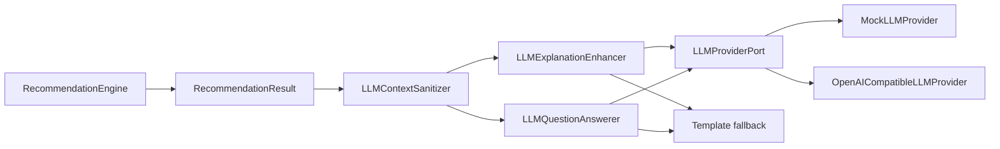

# MediDiet LLM Explanation and QA Design

Date: 2026-05-18
Status: Approved design for planning

## Purpose

MediDiet currently uses a rules-first recommendation engine with deterministic template explanations. The next phase adds large-language-model support for explanation enhancement and patient question answering while preserving the existing safety boundary.

The LLM is a post-processing assistant. It may make explanations easier to understand and answer questions about a completed recommendation. It must not decide meals, modify safety results, bypass allergy or contraindication checks, or invent clinical guidance.

## Scope

### In Scope

- Patient-facing explanation enhancement after `RecommendationEngine.recommend(...)` completes.
- Clinician/dietitian-facing explanation enhancement after recommendation completion.
- Patient question answering constrained to the current recommendation trace.
- A provider abstraction for OpenAI-compatible APIs.
- A mock provider for deterministic unit tests.
- A DeepSeek/OpenAI-compatible provider configuration path.
- An optional integration smoke test against a real DeepSeek API key.
- Privacy-preserving context sanitization before any provider call.
- Fallback to current rule/template explanation when LLM is unavailable or unsafe.

### Out of Scope

- LLM-driven meal recommendation or ranking.
- LLM override of `Outcome`, `SafetyEvent`, `MatchRejection`, `scores`, or selected menu item.
- Medication, diagnosis, or treatment advice.
- Full chatbot memory across sessions.
- Raw image upload to LLM.
- Direct HIS/EMR note transmission to LLM.
- Production HTTP API implementation.

## Current State

Existing files relevant to this change:

- `src/medidiet/engine.py` returns `RecommendationResult`.
- `src/medidiet/explainer.py` produces deterministic explanations.
- `src/medidiet/trace.py` serializes `RecommendationTrace`.
- `src/medidiet/ports.py` defines extension ports, but no LLM provider port yet.

Current behavior:

- Patient explanation is a rule/template string.
- Clinician explanation is a structured dict.
- `clinicianExplanation.llmBoundary` states that explanations are generated from rule hits, nutrition facts, and scored candidates.
- There is no real model call.

## Architecture

Add a new module:

```text
src/medidiet/llm.py
```

The module owns all LLM-specific data structures, provider interfaces, sanitization, output validation, fallback decisions, and QA behavior.



The core recommendation engine remains usable without any LLM dependency. Production services may call the LLM layer after receiving a `RecommendationResult`.

## Data Model

### `LLMConfig`

```python
@dataclass(frozen=True)
class LLMConfig:
    provider: str = "mock"
    base_url: str | None = None
    api_key: str | None = None
    model: str | None = None
    timeout_seconds: int = 10
    send_patient_id: bool = False
```

Rules:

- `send_patient_id` defaults to `False`.
- `send_patient_id=True` is only a future private-deployment extension point.
- The first implementation must not include patient id in sanitized contexts.
- API keys are never logged or serialized.

Environment variables:

```text
MEDIDIET_LLM_PROVIDER=openai_compatible
MEDIDIET_LLM_BASE_URL=https://api.deepseek.com
MEDIDIET_LLM_API_KEY=...
MEDIDIET_LLM_MODEL=deepseek-v4
MEDIDIET_LLM_TIMEOUT_SECONDS=10
```

### `LLMRecommendationContext`

The sanitizer converts `RecommendationResult` into a minimal, privacy-preserving context:

```python
@dataclass(frozen=True)
class LLMRecommendationContext:
    outcome: Outcome
    risk_level: RiskLevel
    rule_version: str
    conditions: tuple[ConceptCode, ...]
    allergens: tuple[ConceptCode, ...]
    meal_label: MealLabel | None
    selected_item_name: str | None
    selected_item_nutrients: Nutrients | None
    safety_event_codes: tuple[int, ...]
    exclusion_codes: tuple[int, ...]
    matched_nutrition_tags: tuple[ConceptCode, ...]
    patient_explanation: str
    clinician_explanation: dict[str, object]
```

Explicitly excluded:

- `patient_id`
- patient name
- phone number
- identity number
- address
- raw image
- full medical-record text
- external request id
- free-form sensitive clinical notes

### Provider Request and Response

```python
@dataclass(frozen=True)
class LLMRequest:
    task: LLMTask
    system_prompt: str
    user_prompt: str
    response_format: str = "json"
```

```python
@dataclass(frozen=True)
class LLMResponse:
    content: str
    provider_name: str
    model: str
```

`LLMTask` is an enum:

- `EXPLANATION`
- `QUESTION_ANSWERING`

### Enhanced Explanation

```python
@dataclass(frozen=True)
class LLMEnhancedExplanation:
    patient_explanation: str
    clinician_explanation: str
    used_fallback: bool
    fallback_reason: LLMFallbackReason | None
```

### Question Answer

```python
@dataclass(frozen=True)
class LLMAnswer:
    answer: str
    used_fallback: bool
    fallback_reason: LLMFallbackReason | None
```

### Fallback Reason Codes

`LLMFallbackReason` must be an `IntEnum`.

| Code | Name | Meaning |
| ---: | --- | --- |
| 6001 | `PROVIDER_NOT_CONFIGURED` | No usable LLM provider or required config missing. |
| 6002 | `PROVIDER_ERROR` | Provider call raised an exception or timed out. |
| 6003 | `INVALID_JSON` | Provider returned non-JSON when JSON was required. |
| 6004 | `MISSING_FIELD` | JSON response missed required fields. |
| 6005 | `EMPTY_OUTPUT` | Required output text is empty. |
| 6006 | `UNSAFE_OUTPUT` | Output violates safety constraints. |
| 6007 | `OUT_OF_SCOPE_QUESTION` | Patient question is outside the allowed recommendation context. |

## Provider Interface

```python
class LLMProviderPort(Protocol):
    def complete(self, request: LLMRequest) -> LLMResponse:
        ...
```

### Mock Provider

`MockLLMProvider` is deterministic and used in unit tests. It should support:

- returning valid explanation JSON
- returning valid QA JSON
- returning invalid JSON
- returning missing fields
- raising provider errors
- returning unsafe text

### OpenAI-Compatible Provider

`OpenAICompatibleLLMProvider` sends requests to an OpenAI-compatible chat completions endpoint.

Expected endpoint shape:

```text
POST {base_url}/chat/completions
```

Expected request body:

```json
{
  "model": "deepseek-v4",
  "messages": [
    {"role": "system", "content": "..."},
    {"role": "user", "content": "..."}
  ],
  "response_format": {"type": "json_object"}
}
```

Implementation constraints:

- Use Python standard library first if practical.
- Do not introduce a mandatory dependency unless needed.
- Apply timeout from `LLMConfig.timeout_seconds`.
- Never include API key in exceptions, logs, trace, or returned objects.
- Provider errors must be converted to fallback in enhancer/QA layers.

## Prompt Policy

### System Prompt Rules

Both explanation and QA prompts must state:

- You are explaining a completed rules-based nutrition recommendation.
- You must not change the recommendation outcome.
- You must not recommend an excluded or unsafe item.
- You must not tell the user to ignore allergies, contraindications, clinician review, or safety warnings.
- You must not provide diagnosis, medication adjustment, or treatment instructions.
- You may only use the provided structured context.
- If the outcome is `human_review_required` or `refused`, clearly preserve that outcome.
- Return JSON only.

### Explanation Output JSON

Provider should return:

```json
{
  "patientExplanation": "string",
  "clinicianExplanation": "string"
}
```

### QA Output JSON

Provider should return:

```json
{
  "answer": "string"
}
```

## Safety Validation

The LLM layer validates output before returning it.

Validation rules:

- Required fields must exist.
- Required fields must be non-empty strings.
- If original outcome is `REFUSED`, generated text must not present the result as a successful recommendation.
- If original outcome is `HUMAN_REVIEW_REQUIRED`, generated text must preserve the need for human review.
- Output must not contain phrases that encourage bypassing allergies, contraindications, clinician review, or safety checks.
- Output must not provide diagnosis or medication advice.
- Output must not introduce a new food item as the selected recommendation.

If validation fails, return fallback output and set the appropriate integer `LLMFallbackReason`.

## Question Answering Scope

Allowed questions:

- Why was this meal recommended?
- Why was a meal refused?
- Why do I need dietitian review?
- Can you explain low sodium or controlled carbohydrates in this recommendation?
- What should I pay attention to when eating the recommended meal?
- What information is missing?

Disallowed questions:

- Diagnosis or treatment questions.
- Medication adjustment.
- Advice to ignore allergy or contraindication warnings.
- General diet planning unrelated to the current trace.
- Questions requiring full medical history.
- Requests to override `Outcome`.

Out-of-scope questions return a safe deterministic answer and `LLMFallbackReason.OUT_OF_SCOPE_QUESTION`.

## Logging

LLM fallback should be logged at `WARNING`.

Do log:

- fallback code integer
- fallback code name
- task name
- provider name
- model
- rule version
- outcome

Do not log:

- API key
- prompt full text
- raw model response
- patient id
- raw image
- sensitive medical notes

Default behavior should not pollute stderr unless the service layer configures logging.

## Testing Strategy

### Unit Tests

Add `tests/test_llm.py` covering:

- sanitizer excludes `patient_id`
- sanitizer includes only safe recommendation context
- `LLMFallbackReason` is an `IntEnum`
- successful explanation enhancement returns LLM text
- explanation enhancement does not modify outcome or recommended item
- provider error falls back to template explanation
- invalid JSON falls back
- missing field falls back
- empty field falls back
- unsafe output falls back
- QA returns mock answer for in-scope questions
- QA returns safe fallback for out-of-scope questions
- OpenAI-compatible provider builds request without leaking API key in returned response or exceptions

### Integration Smoke Test

Add an opt-in smoke test for a real DeepSeek/OpenAI-compatible endpoint.

Test file:

```text
tests/test_llm_deepseek_smoke.py
```

Execution policy:

- Skipped by default.
- Runs only when all required environment variables are present and explicit enable flag is set.
- Does not run in normal unit-test flow unless the user opts in.

Required environment variables:

```text
MEDIDIET_LLM_SMOKE_TEST=1
MEDIDIET_LLM_PROVIDER=openai_compatible
MEDIDIET_LLM_BASE_URL=https://api.deepseek.com
MEDIDIET_LLM_API_KEY=...
MEDIDIET_LLM_MODEL=deepseek-v4
```

Smoke test behavior:

- Uses deterministic demo recommendation context.
- Sends one explanation-enhancement request.
- Asserts provider returns valid JSON with non-empty `patientExplanation`.
- Does not assert exact model wording.
- Does not send patient id or raw sensitive data.
- Has a short timeout.
- Is documented as optional and potentially billable.

### Regression Commands

Normal tests:

```bash
PYTHONPATH=src python -m unittest discover -s tests -v
```

Optional DeepSeek smoke test:

```bash
MEDIDIET_LLM_SMOKE_TEST=1 \
MEDIDIET_LLM_PROVIDER=openai_compatible \
MEDIDIET_LLM_BASE_URL=https://api.deepseek.com \
MEDIDIET_LLM_API_KEY=... \
MEDIDIET_LLM_MODEL=deepseek-v4 \
PYTHONPATH=src python -m unittest tests.test_llm_deepseek_smoke -v
```

## Documentation Updates

Update:

- `docs/api.md`
- `docs/software-design.md`
- `docs/usage.md`
- `docs/testing.md`

The docs must clearly state:

- LLM is optional.
- LLM cannot change recommendation results.
- DeepSeek integration requires environment variables.
- Smoke test is opt-in and may incur cost.
- If LLM fails, MediDiet falls back to deterministic template explanations.

## Acceptance Criteria

- Existing recommendation tests continue to pass.
- LLM unit tests pass without network access.
- Normal test discovery skips real DeepSeek smoke test by default.
- Smoke test can run when DeepSeek-compatible API variables are provided.
- No patient id is included in sanitized provider context by default.
- Provider API key is never present in logs, errors, trace, or test failure text.
- LLM fallback returns deterministic safe text and integer fallback reason code.
- Recommendation outcome and recommended items remain unchanged by LLM enhancement.
