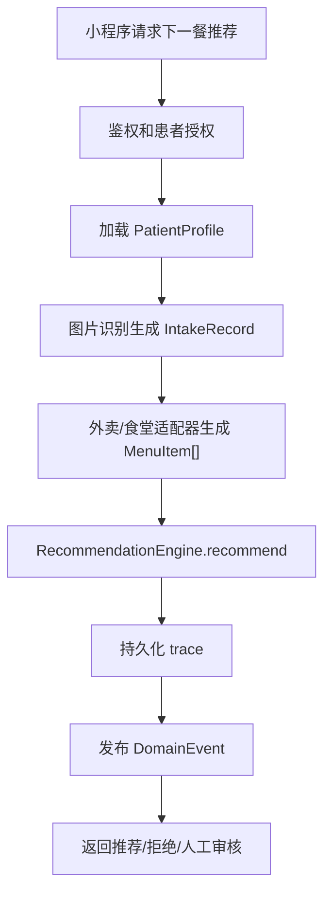

# MediDiet 使用文档

版本：0.1.1
目标读者：开发者、测试人员、部署负责人。

## 1. 当前交付形态

当前项目交付的是 Python 推荐引擎核心包，并提供本地 FastAPI HTTP server 供前端联调：

- 包名：`medidiet`
- 源码目录：`src/medidiet`
- 本地 demo：`python -m medidiet.cli`
- 本地 HTTP API：`uvicorn medidiet.server:app --app-dir src --reload`
- 测试框架：Python 标准库 `unittest`

当前项目不是完整生产服务，不包含：

- 小程序 UI。
- 数据库。
- 真实图片识别服务。
- 真实外卖/食堂平台连接器。
- HIS/EMR 生产连接器。
- 生产鉴权、授权、审计、限流和持久化。

生产部署时应在本核心包外层增加服务入口、适配器、鉴权、审计存储和运行时配置。

## 2. 环境要求

最低要求：

- Python 3.11+
- macOS/Linux/Windows 均可运行，当前开发验证环境为本地 Python + `unittest`

项目当前使用 Python 标准库、FastAPI、Pydantic、httpx 和 uvicorn。

## 3. 获取代码

进入仓库根目录：

```bash
cd /path/to/MediDiet
```

查看当前分支和工作树状态：

```bash
git status --short --branch
```

推荐在功能分支上开发和测试，不直接在 `master` 上改动。

## 4. 本地运行方式

### 4.1 直接使用 `PYTHONPATH`

不安装包，直接运行：

```bash
PYTHONPATH=src python -m medidiet.cli
```

预期输出是一行 JSON trace，包含：

- `traceId`
- `outcome`
- `ruleVersion`
- `scores`
- `patientExplanation`
- `clinicianExplanation`

### 4.2 可编辑安装

如果希望从任意工作目录导入 `medidiet`：

```bash
python -m pip install -e .
python -m medidiet.cli
```

如果团队只做本地开发和测试，也可以继续使用 `PYTHONPATH=src`，避免环境里残留旧安装版本。

### 4.3 本地 HTTP Server

安装依赖：

```bash
python -m pip install -e .
```

启动 API：

```bash
uvicorn medidiet.server:app --app-dir src --reload
```

OpenAPI 文档地址：

```text
http://127.0.0.1:8000/docs
```

健康检查：

```bash
curl http://127.0.0.1:8000/health
```

## 5. 运行测试

运行全量测试：

```bash
PYTHONPATH=src python -m unittest discover -s tests -v
```

运行单个测试文件：

```bash
PYTHONPATH=src python -m unittest tests.test_engine -v
```

运行单个测试用例：

```bash
PYTHONPATH=src python -m unittest tests.test_engine.RecommendationEngineTest.test_fixture_demo_returns_trace_json -v
```

当前测试覆盖说明见 `docs/testing.md`。

## 6. 本地 demo 数据

本地 demo 数据在：

- `src/medidiet/fixtures.py`

入口函数：

```python
from medidiet.fixtures import DEMO_NOW, demo_request

patient, intake_records, menu_items, meal_label = demo_request()
```

demo 内容：

- 患者：成人，高血压 + 糖尿病，偏好清淡。
- 今日摄入：一条午餐摄入记录。
- 菜单候选：一个安全可推荐项，一个不可用项。
- 下一餐：`MealLabel.DINNER`。

## 7. 在业务代码中调用

```python
from medidiet import RecommendationEngine, load_baseline_rule_pack
from medidiet.domain import MealLabel

rule_pack = load_baseline_rule_pack()
engine = RecommendationEngine(rule_pack)

result = engine.recommend(
    patient=patient_profile,
    intake_records=today_intake_records,
    candidate_menu_items=candidate_menu_items,
    meal_label=MealLabel.DINNER,
)

if result.outcome.value == "recommended":
    selected = result.recommended_items[0]
    print(selected.name)
else:
    print(result.patient_explanation)
```

注意：

- `meal_label` 必须是 `MealLabel`，不要传 `"dinner"` 之类字符串。
- 疾病、过敏、禁忌、标签、食材应使用 `ConceptCode`。
- 外部 API 的原始 payload 应先在适配层转换成核心 dataclass。

## 8. 安全日志配置

默认情况下，`SafetyGate` 使用 `NullHandler`，不会输出 warning 到 stderr。

如果需要把安全阻断和不确定性写入文件：

```python
from medidiet.rules import load_baseline_rule_pack
from medidiet.safety import SafetyGate

rule_pack = load_baseline_rule_pack()
gate = SafetyGate(rule_pack, log_file_path="logs/safety.log")
result = gate.evaluate(patient, menu_items, intake_records)
```

日志内容包含：

- 时间戳。
- 日志等级。
- 进程号。
- 线程号。
- 整数 `SafetyCode.value`。
- `SafetyCode.name`。
- 患者内部 id。
- 菜单或摄入 entity id。
- 规则包版本。

日志原则见：

- `docs/superpowers/specs/2026-05-15-safety-logging-principles.md`

生产部署时还需要在服务层补充：

- 日志轮转。
- 日志留存周期。
- 敏感字段脱敏。
- 审计访问权限。

## 9. 规则包管理

当前规则包入口：

```python
from medidiet import load_baseline_rule_pack

rule_pack = load_baseline_rule_pack()
```

当前 baseline 规则包是演示基线：

- 版本：`baseline-2026-05-15`
- 覆盖：高血压、糖尿病、高脂血症、体重控制。

生产前必须完成：

- 临床营养师或医生审核。
- 医院适用人群确认。
- 规则来源、版本、审核人、发布日期记录。
- 灰度发布和回滚策略。

新增疾病或医院自定义规则时，优先扩展：

- `ConceptRegistry`
- `ConditionRule`
- `NutrientLimit`
- `RulePack`

不要在 `RecommendationEngine`、`SafetyGate`、`MenuMatcher` 中写死新疾病字符串。

## 10. 后续服务化部署建议

当前核心包可被包装成一个应用服务，推荐分层：

```text
HTTP / RPC Controller
  -> Auth / Tenant / Patient permission
  -> Payload validation
  -> Adapter layer
      -> PatientContextPort
      -> IntakeEstimatorPort
      -> MenuProviderPort
  -> RecommendationEngine
  -> EventPublisherPort
  -> Response mapper
```

服务化时需要新增：

- API 鉴权。
- 患者授权和数据访问控制。
- 请求幂等 id。
- 规则包版本选择。
- trace 持久化。
- 人工审核队列。
- 外部服务失败降级策略。
- 配置化日志和监控。

## 11. 建议的生产请求流程



## 12. 常见问题

### 12.1 为什么 CLI 输出的 `traceId` 和 `createdAt` 每次不同？

`traceId` 使用 `uuid4()`，`createdAt` 在 trace 创建时生成，因此每次运行不同。这是预期行为。测试只断言字段存在和核心逻辑，不断言完整 JSON 字符串相等。

### 12.2 为什么推荐解释里标签顺序可能变化？

内部使用集合表示标签，集合顺序不作为业务契约。测试关注解释中是否包含必要信息，不依赖所有文本顺序。

### 12.3 如何接入真实外卖平台？

新增一个适配器实现 `MenuProviderPort`，把外卖平台商品转换成 `MenuItem`。适配器必须提供：

- 结构化食材和过敏原。
- 营养值或估算值。
- 营养数据来源。
- 置信度。
- 价格、距离、可用性、商家可靠性。

### 12.4 如何接入图片识别？

新增一个适配器实现 `IntakeEstimatorPort`，输出 `list[IntakeRecord]`。低置信度记录会触发安全门禁的不确定性，进入人工审核路径。

### 12.5 如何清理本地缓存？

Python 运行后可能生成 `__pycache__`，这些不应提交。可以按需删除：

```bash
find src tests -type d -name __pycache__ -prune -exec rm -rf {} +
```

## 13. 可选 DeepSeek / OpenAI-compatible LLM 配置

MediDiet 的 LLM 层是可选增强层。推荐结果仍由规则引擎决定，大模型只能增强解释或回答本次推荐相关问题。

环境变量：

```bash
export MEDIDIET_LLM_PROVIDER=openai_compatible
export MEDIDIET_LLM_BASE_URL=https://api.deepseek.com
export MEDIDIET_LLM_API_KEY=你的_api_key
export MEDIDIET_LLM_MODEL=deepseek-v4
export MEDIDIET_LLM_TIMEOUT_SECONDS=30
```

可选真实接口 smoke test：

```bash
MEDIDIET_LLM_SMOKE_TEST=1 \
MEDIDIET_LLM_PROVIDER=openai_compatible \
MEDIDIET_LLM_BASE_URL=https://api.deepseek.com \
MEDIDIET_LLM_API_KEY=你的_api_key \
MEDIDIET_LLM_MODEL=deepseek-v4 \
PYTHONPATH=src python -m unittest tests.test_llm_deepseek_smoke -v
```

如果 `.env` 已配置完整 LLM 变量，也可以用同一组配置验证 HTTP 推荐链路：

```bash
set -a; source .env; set +a
PYTHONPATH=src python -m unittest tests.test_http_llm_smoke -v
```

该测试默认跳过。启用后会访问真实模型 API，可能产生费用。测试不会发送患者真实 id、原始图片、地址或完整病历。
